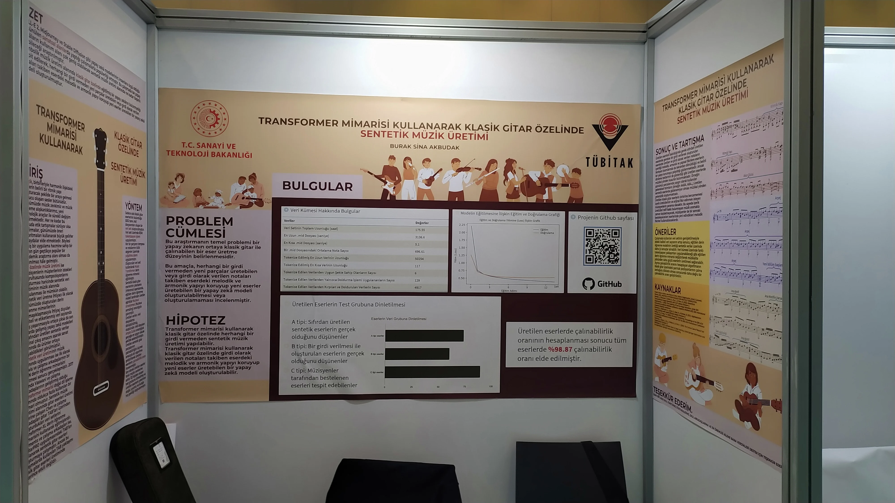
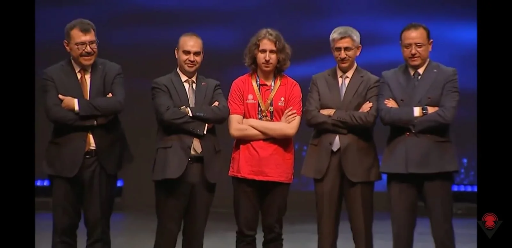

> **Note (EN):** If you know Turkish, I highly recommend you to read this article in Turkish. Beacuse it is the original version.  
> **Not (TR):** Yazının orijinal versiyonu Türkçe olduğundan dolayı eğer biliyorsanız bu yazıyı Türkçe okumanızı tavsiye ederim.

## Day 0 - Saturday Night

Bus ride. It had been a long time since I last took a bus. But sitting in a single seat is comfortable, more spacious than I expected. I put my guitar next to Hakan Hoca. It seems safe there. Things are good. I might fall asleep soon, or maybe listen to the Skyrim album like I did on the way to Paris? Tough decision.

I finished the Skyrim album. Then I thought of listening to Hiromi, but it was too much jazz for the night.

## Day 1 - Sunday

There was no breakfast at the hotel, so we went out for breakfast. We had pizza with Leylek. It was quite good. Afterward, we walked around a lot. There were big markets. It was fascinating to see how the concept of street markets had completely disappeared in big cities, with vendors inside those huge markets throwing vegetables and fruits into bags. Interesting.

Now I’m back and resting. After lying down for a bit, I’ll probably review the presentation again. Then dinner. We’ll likely review it one last time after dinner and try to sleep early.

I ended up sleeping until dinner. It was refreshing. The dinner was good, though I got scolded for taking too little food.

After dinner, I worked on the presentation, went through it three times, and played a lot of guitar.

## Day 2 - Monday - Start of the Exhibition

Rushed breakfast in the morning. Now we’re on the bus. This part could have been planned a bit better, but no big deal.

In the morning, I met a nice guy sitting next to me, an electric guitarist. Good conversations we had. Despite being my competitor, I didn’t sense any ego just like other people have. Seems like a good guy.

Some of my competitors came over and asked silly questions. They seemed either condescending or scared, not sure. I might confront them later.

The guy we met at IYTE last year when doing physics is here again. Name is Eren. Nice, friendly guy. We hung out with him and his friend, both pianists. We talked about music theory, etc. Enjoyed it!.

There was also a guy who claimed to be a bass guitarist. The first thing he asked was if I paid attention to root positions. He mentioned his interest in theory. Also, while I was playing Asturias for someone, a middle school girl came up and said, "Isn’t this Isaac Albeniz’s Asturias?" Cool stuff.

For dinner, while looking for a spot with Leylek, we saw Eren’s table was empty. We decided to join them. Another guy was sitting with Eren.

In the evening, I spent quite a bit of time with Leylek. I listened to their presentations, and they listened to mine. We brainstormed what could be improved. It was helpful, I think. I shortened a few points. I’ll continue tomorrow.

## Day 3 - Tuesday - Presentation Day

I couldn’t sleep well anyway. I kept debating whether to get up or not. I had time, but I didn’t feel like getting up. Eventually, I managed to go down for breakfast.

Had a nice breakfast. Tried the chocolate with hazelnut pieces my brother suggested from the market. It was quite good. We ate a bit.

We wore the red shirts they gave us yesterday for breakfast. I liked them a lot; I’ll probably wear them again later. There’s also a coat, but it doesn’t seem very useful. We’ll see where to use it later.

A guy from Adana BILSEM came, talking about using LSTM in the music industry. The LSTM didn’t perform well. They didn’t make it to the finals. It’s unfortunate for them. But it breaks my assumption that there are no synthetic data generators in 2204A. There are, but they perform poorly.

It was announced yesterday that there would be jury presentations. We thought they’d be more likely the next day. It wasn’t, so we did our presentations today. At least I and my roommate did; Leylek will present tomorrow.

In the morning, we went to the stand and saw men in suits with briefcases walking around. They were the jury. The art teacher from my region is also here as a jury member. I recognized him while walking around in the morning. When he came to the stand, I realized it was him. There was another guy with him, very cold; he didn’t show much interest while I was explaining and didn’t ask questions during the presentation. It raises some suspicion because it could go either way. I don’t think I made any big mistakes in the presentation. I answered the questions well. They didn’t ask the challenging ones I expected. The questions were easier, and I answered them. Anyway, we’ll learn the result on Friday.

Afterward, I reviewed high school math projects. Honestly, almost all of them are garbage. I couldn’t listen to the matrix project from the TAKEV crew; the girl is so chill that her stand is empty all day. Besides that, there’s nothing noteworthy. Middle school math projects were much more enjoyable to listen to. High school projects are really boring in that regard.

I also randomly listened to one sociology, one education, and one literature project. After one, I don’t think I can listen to another one. These fields are generally not for me. I listened to one chemistry project from the 9th graders. It wasn’t that bad.

Lastly, I toured a middle school project with the TAKEV crew. We checked out one bio, one chemistry, and one physics project. Two out of three people at the bio stand were girls with excellent diction. Impressive. It was enjoyable to listen to; I wish I could have asked better questions.

Overall, that’s how it went. The rest of the exhibition is quite calm now. I’ve seen most of it, and I’ll try to make a few more friends. I’ll try to befriend the guys next to us. I already have, but I want to get closer. The guys there seem decent. There are a few more guys from software design, but I’m not trying to befriend them for some reason. I don’t know why. We’ll see tomorrow.

In a bit, I’ll head to the mezzanine to hang out with Leylek. I’ll hang out there for a while, then come back to sleep. That’s the plan!

P.S.: I studied math olympiad at Leylek’s place in the evening, then went to bed.

## Day 4 - Wednesday - Public Day

I’m quite late in writing today’s events, but I don’t want to leave it for the next day because it would overlap with that day, and I might get lazy. So I’m planning to write and then sleep.

I caused a bit of a mess at breakfast. Trying a bit of everything was a bit heavy, honestly. Especially pure tahini, I discovered, is tough to eat.

After breakfast, we went to the exhibition as usual. The roads are the same, the first moves are generally the same. My goal today was to visit the last few exhibits and connect more with the new people I met. I think I did that. I spent quite a bit of time at the stand in the morning. I had a lot of visitors, especially compared to my previous project. I saw many different people throughout the exhibition. It was quite satisfying. At some point, I started giving almost perfect presentations. Every sentence and word seemed to be the best choice. Telling the same thing a zillion times really improves you. Now I understand why teachers are so knowledgeable about the subjects they teach.

In the morning, the press shot about a 1-minute video of us. More precisely, a guy with a camera and a “PRESS” badge written with a CD marker on his card was trying to record everyone’s exhibition presentations, and eventually, he came to us. I worked on it a bit, presented it, and moved on. It was clean, I think.

After many visitors, the lunch break came quickly. After a nice meal, we hung out with Leylek for a bit. Then I noticed someone from the TAKEV crew, and we toured a few more projects together. After a few projects, we returned to our stand and talked about calc stuff. The guy had been working on calc for a long time and learned new things, which he shared. It was enjoyable.

Of course, while hanging out with them, a few visitors came by. I explained to them as well. But one of the visitors was one of the two guys who went to ISEF last year. Their field is probably software design too. They had come on the first day of the exhibition, but this time they came with notes. Apparently, they were measuring if we were good enough for ISEF. They asked silly questions to others as I've heard but couldn’t ask me much because either I explained well, or they didn’t understand properly. Not sure. We’ll see.

In the afternoon, Hasan Mandal and Ursavaş came. Ursavaş held a 2-3 hour conference with the teachers. Then Hasan Mandal spent about an hour with us. He talked about the things TÜBİTAK does. Then there was a silly Q&A. Middle schoolers, what can you say?

We got back to the hotel a bit late due to the conference. After dinner, we spent hours deciding what to do and finally decided to go for a walk. We walked a few laps, bought some stuff from the market, and then came back to the hotel and played a storytelling game while munching on the snacks we bought.

Tomorrow is the tour. Let’s see how it goes.

P.S.: I met an IFL 2002 graduate today, but forgot to mention. I’m curious if I’ll see an IFL student when I grow up and attend high school.

## Day 5 - Thursday - Ankara Tour

Every morning, our wake-up time shifts by about half an hour. This morning, we woke up a bit late. We were actually planning to wake up even later, but since my roommate had to get up earlier, I woke up early too. I think the air conditioner got to us a bit; we woke up with sore throats. It's still not quite well.

If I keep eating these breakfast buffets, I really feel like I'm going to gain weight. We actually have the option to eat healthier because there's a lot of fruits and vegetables, but you just don't feel like it. So honestly, I'm looking forward to this adventure ending so I can get back to my proper dorm routine. It's nice and all, but only to a certain extent. You need to create a routine here, but there's no need since we'll be leaving soon anyway.

After breakfast, we jumped on the bus and went to the National Library. It's a really nice place. A huge building. There were quite a few people inside. They even have free food and drink services. And, of course, lots of books. If I end up studying in Ankara, I'd like it to be a place I visit often.

Finally, we went to the Museum of Anatolian Civilizations. It's a place with artifacts from different civilizations that lived in Anatolia. That place was also very impressive. There were truly captivating figures. In the future, if we print 3D figures themed around bronze, stone, and ceramics, I took lots of photos for reference. I even made one of them my profile picture, a half-faced guy. This place was really great.

We were supposed to return from the trip at 17:30, but we got back around 15:40. We went shopping with the teachers for some snacks for the evening's movie night. I'm even downloading the movie right now. Resting a bit too.

In the evening, we had a movie night. Only one teacher stayed to watch with us. Everyone else left. It seemed like everyone wanted to watch a movie. Especially *Leylek*, who is next to me right now, never wanted to watch it. Afterwards, we chatted with the TAKEV group for about 2 hours. Cool conversation.

## Day 6 - Friday - Award Ceremony

We woke up in the morning. We didn't really sleep, but I'm not tired. Probably because I slept in the afternoon yesterday. We actually left the room late, but the only problem was having to carry the suitcase up eight flights of stairs because we couldn't use the elevator. We checked out of the hotel and had breakfast. I had even less appetite compared to other days, but I still ate something.

Now we're back at the venue. We're waiting around to give our presentation to the suit-wearing officials if they come. Waiting.

The rest is what I wrote on the bus, trying to relieve the fatigue of the week a bit. The 2204A Final is over; let me explain how it ended.

While we were waiting for the officials, we were tearing down the poster. Just then, a guy from ISEF, one of the people who asked me questions, came by. This time he asked for my phone number. He said I was likely to win a prize. Tbh, when he said that, I already understood that I would get first place. But still, you have that "what if" question in your mind, so while waiting in that crowded hall, with software design being announced last, your heart still beats very strongly.

The officials only came for the award ceremony. We gathered in the crowded hall, and after the VTR and protocol speeches, they started with the awards. Since the Minister of Industry had other engagements, the first prizes were given first. When they announced "Izmir" during the software design category, my friends were already sending me off to the stage with punches. It was joyful. I'm genuinely happy to have a photo with Hasan Mandal.

After that, Leylek's team got second place, and our my roomamate got first place too. We took photos with the TAKEV group and amongst ourselves. During this time, Ismail Abi came outside. I met the Karaman Provincial Director of National Education, which was quite crazy. Then we went to AŞTİ for food. After that, we got back on the bus. Now, we're moving on the bus.

A tiring six days, a pleasant six days. But really, the end of the day was incredible. I think I'm happy. But I'm also confused. University selection, ISEF... I need to do a lot of research. I've given myself a lot of work to do, lol.

I cannot thank enough to my brother, mom and dad for their endless support. I'd also want to thank my friends and school for their trust in me.
