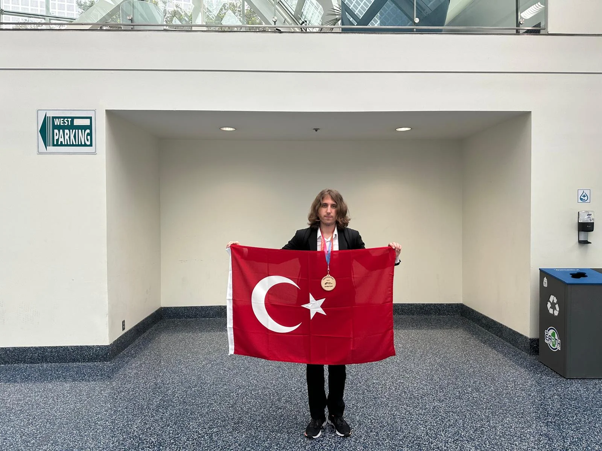

> **Note (EN):** If you know Turkish, I highly recommend you to read this article in Turkish. Beacuse it is the original version.  
> **Not (TR):** Yazının orijinal versiyonu Türkçe olduğundan dolayı eğer biliyorsanız bu yazıyı Türkçe okumanızı tavsiye ederim.

The time has finally come.

## Day 1 - Travel

We arrived at the airport without any issues in the morning. We'll wait for about an hour.

I got called from the counter. Funny thing to be called. They wanted to call someone from the ISEF team but called me instead. No big deal.

Had no trouble placing the guitar. There was space for it as cabin baggage, but I don't expect the same for the US flight.

We reached Istanbul Airport. It's still as huge as ever since I last left it. It took about 20 minutes just to get to the parking position.

While waiting for the LA flight, we didn't do much. Time passed quickly with chats and talks. Refilling my water was a good idea.

We're on the plane now. The guitar doesn't fit in the overhead compartment. It's between my legs for now, but the flight attendants said they'd help. We'll see.

Finally managed to store the guitar. For about 15 minutes since boarding, I was nervously thinking about where to place it. Once boarding was complete, I found a large space for it without any issues.

I think I've had this menu before, probably on my way to Brussels. It was quite satisfying.

This is really a ridiculously long journey. I've gone through most of what I prepared (one of two movies, calculus study, geography book, many of the albums I downloaded) and there's still two hours left. I think I'll eat the second meal, work a bit more on my presentation, and listen to music. Hopefully, we reach the hotel safely.

We waited for about 1-1.5 hours during the transfer. We've collected our luggage but at what cost. We're resting a bit on the side while most of our group is still upstairs.

Time to sleep.

## Day 2 - Shopping

Woke up and took a shower. My roommate is a good guy. We didn't talk much since we were tired. We're waiting to go down for breakfast.

Had an Oreo waffle for breakfast. As they said, the portion was big. I got full but it wasn't a very healthy breakfast, lots of sugar.

We went back to the hotel and waited for about half an hour until the exhibition opened. Then, after waiting for those who were late, we went to the LA Convention Center. We hung out with a Ukrainian guy while waiting in front of the center. We handed over our passports and registration forms and are now waiting to register.

Got our cards and badges. Kept them nicely, hopefully, I won't lose them. There's a small bag too, cool.

Now, we're calling an Uber with TÜBİTAK personnel to go to the outlet. Chatting and walking around.  

Passed by Corridor Digital. Didn't see the building fully but saw the neighborhood, and it really looks just like in the videos. Pretty cool!

After a nice Uber ride, we arrived at the outlet. It's just like Forum Aydın tbh. The whole outlet logic is the same as ours. It's a bit crowded since it's Saturday.

Writing this because Leylek asked, he bought a necklace for his mom from Swarovski. Yeah.

Shopping part was boring. No electronics store, they said maybe they'd take us to Best Buy later. Hopefully, I can get my headphones there. So far, just hanging out with our group. Dinner soon.

I'm hungry. My battery is at 5%. Not good.

## Day 3 - Initial Setup

As soon as I got back, I fell asleep. Sent a few voice messages and slept. Shopping mall days aren't really my thing.

When you sleep at 8:30 PM, naturally, you can't sleep through the night. Woke up around 4:30 AM feeling rested enough. Decided to use the bathroom first, then called our folks. Talked to people for two hours. First my mom, then my brother, then the guys from our dorm, and then my dad woke up, so I talked to my parents again. It was nice. Probably won't find time again. We'll see. Got another two hours before we leave the hotel. I'll probably work on my presentation. Then breakfast and head to the venue to put up the poster.

A lot happened. Now I'm writing them quickly. We arrived at the venue, put up our posters first. Messed up the middle part initially but managed to fix it. Shouldn't have done it alone. Thankfully, later Nisa helped and we managed. After completing the poster, we went to the HUB, checked in, and started waiting for the inspection. Just as I was about to say we were waiting, the initial inspector arrived. I hadn't even pinned my summary to the table yet. He was very helpful. They are very calm. The guy stayed with me for about 15-20 minutes, at least it felt that way. Afterward, the second inspector came. An old, sweet lady. Then, I QR scanned the guitar and laptop. You scan them every time you enter and exit. Thus, I passed the inspection process in one go.

Then I refilled my water and went for lunch. Grabbed a cheese pizza and ate it. We hadn't eaten anything in the morning, so it was quite satisfying.

Then the career fair started. There's a thing called a passport where you collect stamps from 10 groups. I collected all in an hour. Stupidly spent another hour looking for where to take it, but it was in the same place all along. Anyway, sorted that out. Hopefully, I'll win $25 from the ISEF Store. Maybe I'll buy a t-shirt, I don't know.

My Danish friend arrived. Came while I was talking to a journalist lady. Then I went over to her for a chat. There's a pin exchange later. Until then, we have a lot of free time. I'll probably play my guitar. I took a nice video of the surroundings, need to send it to the groups and people but I can't connect to the internet somehow.

I won the passport thing! Went with Leylek. Initially, we thought of getting 3 mugs. But there wasn't one for our category. So, I got a t-shirt. It's pretty cool. There was a better one, but it was sold out and won't be restocked.

Wandered around aimlessly. Wish I had socialized with other projects. A mistake, I made.

In the evening, there was a pin exchange. Breaking the ice for 1600 people isn't easy. The environment was noisy, making proper conversation almost impossible. In the first hour, we shared all the Turkey pins with Leylek. Later we sat with the TÜBİTAK team, chatted, etc. Then went back and went to bed directly. It was tiring.

## Day 4 - Symposiums

Got up in the morning, went down as if to have breakfast but didn't eat. Chatted a bit with our folks. Missed the first group and went to the venue with the second group.

First thing, we took a photo with the Turkish flag. It felt good. I love representing my country. Then we went to the symposiums.

The first one was about how judges evaluate. Good presentation. My notes:

>Elevator pitch is about 30 sec.  
>If the scheduled judge doesn't come, say it to the cochairs.
>Printed name has priority when two judges come.
>Judges shouldn't leave after 5 mins.

The second one was about how to apply to a university. My notes:

>"I hope the most important thing about me is not Yale."
>If you have an interdisciplinary person, you don't need to think about one of the disciplines overshadowing the other. "Put yourself on the table."
>Your interest can and will probably change.
>About the questions: it's okay to ask, you know. We won't remember it after reading.

The third one was about writing essays. My notes:

>Anxiety: "My essay won't stand out.", everyone have that.
>Why even essay: "You are more than your GPA."
>"Essays are not resumes. We already have your resume. We look for stories and experiences."
>"Let your personality shine. If you are funny, write an essay that has jokes in it."
>"Multiple people look at your application. We literally project your essay onto a wall and read it with 3 officers, DA, and a faculty member. We care!"

Afterward, went to the venue and worked a bit on my presentation. Our folks came and went. Didn't go for lunch today. I could have eaten, but I didn't feel like it. After the symposiums, it was around 3 PM. I suggested going to BestBuy to TÜBİTAK personnel. He said it would be better to go tomorrow, as it might be difficult to make it back for the opening ceremony. I trusted his judgment and didn't insist.

First, we went back to the hotel, played the guitar for an hour, then headed back to the venue for the opening ceremony.

Got in line for the opening ceremony, and the line got so long behind us. Glad we went early, though it didn't seem early to us when we arrived. Not much to say about it. Nice, good hype. The VTRs were a bit lackluster now that I think about it. Doesn't matter, the important one is the awards ceremony.

## Day 5 - Student Mixer

I woke up early in the morning. I researched a few questions I had in mind and took notes on them.

Interestingly, we didn't wait for 15 minutes this time; we left the hotel after a short delay of 2-3 minutes. Today, since VIPs and sponsors would be visiting, people were dressed in business attire. I wore a ISEF t-shirt, hope it won't be a problem.

Upon arriving at the venue, they let in the problematic projects and did a final D&S check. Instead of waiting in an endless line, we sat on the sidelines. Then we went inside and moved to our spot.

While sitting and playing the guitar, two or three interested people came by. I presented a little, chatted, and then hung out with the TECA team for a while. Since they are all Americans, their culture, the things they talk about, and their ideas are similar. I felt a bit distant to be honest. I think I generally get along better with Europeans.

Then we went outside (we had to wait quite a while even to go out). We met up with our group and attended a not-so-enjoyable panel. After listening for a bit, we went outside.

After the panels, we went back to the hotel to go to BestBuy. We had arranged it with TÜBİTAK personnel and went and came back within a few hours. Finally got my headphones.

Then there was the Student Mixer. Party and all. The dinner before that was quite nice. After chatting with my Danish friend for a bit, we returned to the hotel with friends. The "you need a teacher to go back to the hotel" is no longer relevant. Four of us went to the hotel. On the way back, I met a Turkish researcher interested in my work, who expressed a desire to talk again in the future. Upon arriving at the hotel, I went to the room, reviewed my presentation one last time, and sent a few voice messages to my folks.

## Day 6 - Presentation Day

Today is the day. The presentation day.

I woke up and took a shower. They said to leave at 7:15, and fortunately, I guessed right and got up at 6:30. We got ready and went downstairs, arriving at the LA Convention Center with a 7-minute delay.

After waiting in a long line for a while, we went inside. The first 1.5 hours were for special award judges. There is only one special award suitable for me (besides TÜBİTAK), so I don't expect anyone to come, honestly.

There are 9 judges listed on the paper on my table. You can't be sure if all 9 will come due to no-shows and extras. Let's see what happens. Personally, all I want is for things to go smoothly and well. I can't really think about winning or losing right now. Whatever is meant to be, will be. I've always said this and always will.

As expected, no special awards came in the first 1.5 hours. I have about half an hour until my first judge presentation. Let's see.

A leading figure for the new category TECA came. He's a TECA judge but not my judge. We had a nice conversation.

Another person with free time came. It went quite well too. I might have not used my best English, but it was still good experience.

Another judge came. He seemed like a good person. He asked a lot of human evaluation questions. I answered all of them, hopefully to his satisfaction. He wanted percentage-wise data a lot. Maybe it would have been better to present something percentage-based instead of confusion matrices, I don't know.

A judge lady came, an east music singer. It was a nice conversation. I think I presented well. They like the question about whether you want a presentation of different lengths. The previous judge had also mentioned it.

Just before lunch, a judge came. He exactly looked like a typical American. He came, and before I could even start talking, he started saying random things. He looked at the poster a bit, then talked about his child. I didn't even ask if I should present. Then he started telling stories about his experiences, which had nothing to do with the project. My heart was pounding, trying to find a way to relate it to the project, but I was also afraid of making him dislike me. He's a judge, after all, and pushing him could be disadvantageous for me. Anyway, 15 minutes passed somehow. Right next to me, a different TECA contestant approached me and asked if my experience was terrible too. I said yes, I had never encountered such a judge. Later I learned that he behaved even worse to others, so they complained about him, and he was removed from judging due to the complaints, unable to attend the afternoon sessions. He was a very strange man.

For lunch, I had cheese pizza again, quite nice and filling. We sat for a while, and then moved on to the afternoon presentations.

In my first presentation of the afternoon, a very serious judge came. It went well, though. He was into more the technical stuff, asked technical questions.

Then some special award judges came while we were hanging out. They were looking at AI projects, but I didn't present well. Didn't matter much, as they weren't very interested in my work. They gave a couple of gifts and left.

The judge I just presented to was really good. I wish I could have presented better. He asked me to explain tokenization in detail. It's tough to explain even if I've done it hundred times. I think he liked it, though. Hopefully, he' did.

I have a 30-minute break now. Three left. After that, another 30-minute break. But then I have two back-to-back judging sessions, without a break. Hopefully, they'll go well too.

A strange lady came, just listened with a smile. Said Turkey was nice or something. I'm sure she didn't listen to what I was presenting. I wish I had made it shorter so she could leave even earlier. At least she asked a couple of very general questions, like if there was any intellectual property and what could be added in the future and so on.

Presented to an LAPD officer. It was weird :).

Another judge lady came. I think she liked it. I hope so.

Then I presented to a nice judge. It was going well overall. Then he asked how long I had worked on it. I said a year. He said it was too little. Said to develop it further and left. He asked about limitations too. He was a good guy, but his comment upset me. Oh well. Hopefully, it'll turn out well.

Now going back to the hotel to rest. Then Universal Studios. I'm really tired, but I guess I'll rest.

For Universal Studios, we hurriedly went up, changed, and came down. Then we got on the bus and started heading to the venue.

We got off, extremely hungry, and went down to the bottom. First, we went to the Mario Kart thing without knowing it was Mario Kart. When they said food was free, we quickly left and went to the nearest restaurant. Ate chicken and rice at the Jurassic Park-themed place, but both were not my tastes. Had dessert too. Then we went up a bit more, slightly fuller, and walked around. As evening progressed, it got colder, and it got dark. First, we went to a Harry Potter place but didn't go in because we didn't feel like it. Then, while randomly walking around, we decided to join the Universal Studios tour. Definitely the best decision we made. They prepared an hour-long program with 3D glasses, huge sets, water sprays, fire, historical events for the universal studios being narrated, comparisons with new ones. It was really, really, really good. Then we walked around a bit more, went to the Hogwarts bathroom, and hopped on the return shuttle. Nice evening. Came back extremely tired but somehow feeling unexpectedly rested. The adrenaline rush might have reversed some things.

## Day 7 - Public Day & Special Awards Ceremony

I've opened my eyes at 5 in the morning. I wasn’t rested, but I reached for my phone anyway. Checked messages, chatted with a few people. Then I slept for another hour or so and woke up still not feeling rested. Leaving the hotel felt difficult today, to be honest. I was really tired, not just from yesterday, but in general.

In the morning, I had a cookie and went to the venue. First, I joined the TECA crew for breakfast. One of the judges from yesterday gave a presentation. Good man. He works in film production but has a degree in mechanics from Harvard. Quite a career. After that, we played an ice breaker game and took some photos. Then we went back to the venue and started presenting to the arriving visitors.

A classical violinist came by. Really solid guy. He asked some sweet questions, both about AI ethics and AI in music in general.

Then a group arrived. I hadn’t dealt with a group like this before. Americans in their 40s, watching in amazement at what the youth are doing. They hung out, chatted a lot. It was great!

Lots of people of varying ages stopped by. The guitar attracted quite a bit of attention.

My lunch break was pretty odd. My friend from TECA next to me said it was time for lunch. Then a Turkish person who had previously said we should talk later came and invited me for lunch. It turned into a sort of business lunch. He talked about his ideas and his perspective on AI. He suggested a few tokenization approaches regarding to music modeling, which I had already thought about, so I quickly understood and explained.

After lunch, an IFL ’93 graduate who had said he would come by visited our booth. I really liked him. He’s currently a researcher at UCS. He’s been in America for a long time, traveled to different places. He hadn’t planned to stay long when he came for his PhD, but family life changes things, I guess. He enlightened me on a few topics I hadn’t thought about before.

After listening to our projects and chatting a bit, I checked WhatsApp and saw that TÜBİTAK personnel said the education attaché from the consulate was coming. I found them and explained the project at the booth. It’s tricky switching between explaining in English and Turkish.

Then one of the judges from yesterday, the one who presented in the morning, came by with his 4-year-old child. The kid wouldn’t stay still, naturally.

After that, we said goodbye to our alumnus and returned to the hotel. The public exhibition continued in the afternoon, but I was extremely tired, so I couldn’t say no to the offer to go back. Nice people come, but I really need to rest. My throat and limbs can’t take much more. We’ll be going to a special awards ceremony tonight. I don’t expect to win any special awards. I’d be thrilled if TÜBİTAK gave one, but if not, that’s okay too. There’s an AI special award that I might win, but I doubt it. SOFT has tons of AI projects, so one of them will probably win. We’ll see.

Just had the special awards ceremony. Turkey had a below-average awards ceremony. We didn’t get the two awards we were expecting, but it’s okay. My friend Leylek and his team got the Qatar award. I didn’t get the TÜBİTAK special award, but that’s fine; it went to our friends.

After the awards ceremony, I went to the room, packed up, and went straight to bed.

## Day 8 - Grand Awards Ceremony

I woke up around 5:00 AM for some reason. Sent a few messages, tried to sleep again around 5:30 for another hour.

Then went downstairs, checked out, and put our luggage in the luggage room. God, I hope nothing happens to the guitar. I brought it all this way without problems, and I definitely don’t want any damage now.

It took forever to leave the hotel, of course. We headed to the main awards ceremony hall again. From now on, fingers crossed.

>Just like in the Ankara Finals, my corner is great. But np, it is the moment which the biggest dice are rolling. Best of luck. *-Leylek Corner*

Exciting award ceremony. The order was 4-3-2-category change-then 1st places at the last. Each category, we wondered if we had a project in it. Great moments.

First, my schoolers got 2nd place, then I did. And that wrapped up the award ceremony. Not a great result for Turkey. Including the special awards from yesterday, we got 6 awards in total.

It felt weird. I feel weird. Like at the finals, I fell into a void again. I didn’t know how to feel. Especially after our alumnus’s talk yesterday. It made me feel a bit insignificant. Even though I had thought about it before, whether I’d win or not, having my plans and dreams suddenly become real was overwhelming. I don’t like award ceremonies, whether I’m receiving an award or not.

Now it’s time to head back. We’ll be on the road for hours, maybe even a day. Traveling is long, boring, and especially tiring. Let’s see.

>Wow. *-Leylek*

## Final Words and Evaluation of the Event

**Thoughts on the event in general:** It’s a good event, definitely not bad. Huge event. Organization-wise, really solid; everyone does their job well. But the first days are quite boring. A lot of uninteresting symposiums. I could say it’s just me or us, but no, it’s like that for everyone you can see it by looking at the number of attendees. Other than that, they stick to the schedule, they’re helpful, they notify everything via email and phone app, etc. The judges were sweet and fun to talk to. The best and most enjoyable day went well, I think.

**On what this event brought me:** I’m glad I came, whether I won an award or not (I’m writing this the day before the award ceremony because I might not bother with evaluations once I’m home.) I’m glad.

Seeing America early was nice, at least CA/LA. I got a bit of understanding of the structure. I saw its people. Throughout the event, I chatted with lots of people, both locals and foreigners, both from afar and up close. On the public day, if I hadn’t been so tired in the afternoon and stayed at the booth, I might have met even more people, but that’s okay.

My presentation skills and language proficiency improved quite a bit. I saw more clearly where I got stuck and what I did well. I realized I’m not that bad at design and poster preparation.

**As I wrote in the ISTF24 report:**
>I am eternally grateful to TÜBİTAK for giving me the opportunity to represent my country.
