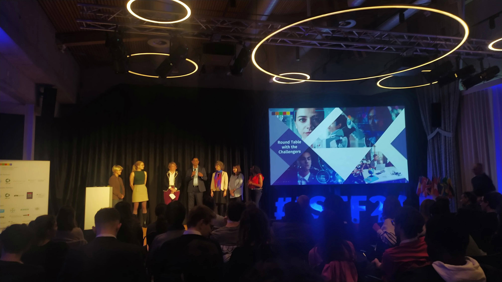
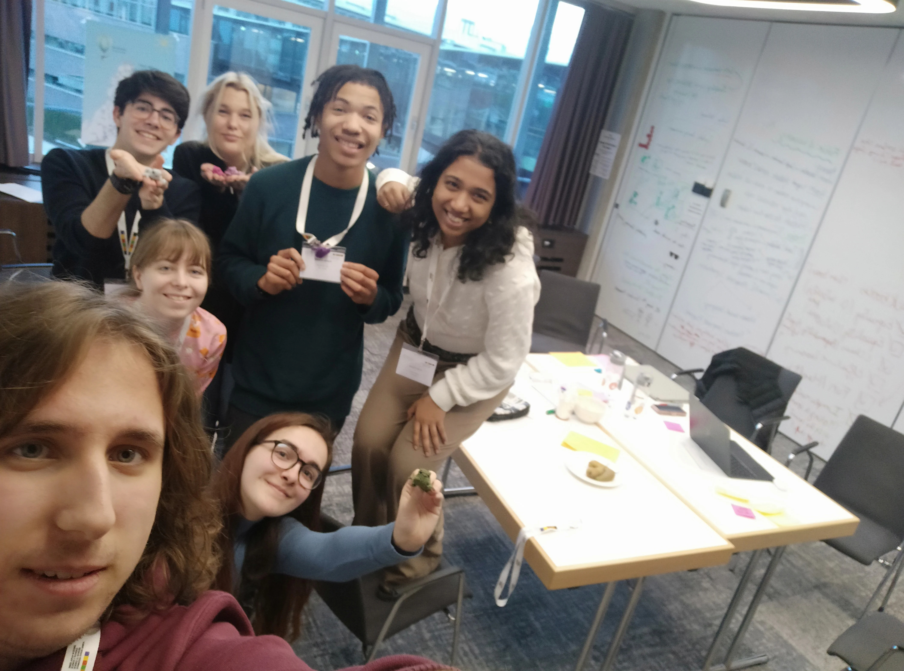

> **Note (EN):** If you know Turkish, I highly recommend you to read this article in Turkish. Beacuse it is the original version.  
> **Not (TR):** Yazının orijinal versiyonu Türkçe olduğundan dolayı eğer biliyorsanız bu yazıyı Türkçe okumanızı tavsiye ederim.

## Day 1

Not day 0 because there are half-day activities upon arrival.

We woke up at 3 AM and arrived in Izmir. I took the Izmir-SAW flight without any issues with baggage or transitions. I'm getting used to this!

I reached SAW, wandered a bit, found the international departures, and my gate was right there in line. I waited for a while, wrote some things on my phone, and listened to music. I boarded the plane and took my seat, 40E, the last row middle seat—the worst technically. But the back was pretty empty, so I moved to a three-seater alone. Nice, I was a bit sleepy.

Thankfully, we landed in Zurich without any problems. I slept for about an hour and wrote a bit. They only allowed exit from the front door, and I was at the very back. Sad.

Had an adrenaline-filled 15 minutes. Passport control and baggage claim were smooth. I followed the signs to the train, which was easy. Their train ticket system is very clean. I saw the SBB mobile app for the train location. I bought the first train to Notwill with few transfers. It was leaving in 5 minutes, and I had no idea where it was. I randomly took an escalator down, asked an elderly couple about the train. The man checked on the app, said I had to go to the center first, then Luzern, then Notwill in 20 minutes. We talked again while getting off the train, he showed me the wagons and took a photo of the SBB screen. I realized I could access saved routes offline. It was epic. Now I'm a bit relaxed, hope I won't have issues with other trains. I'm going to the last stop for now.

Met the happiest ticket inspector ever. Scans tickets on the phone, punches holes in physical tickets, and writes stuff. So strange.

Two more trains to Notwill. Nice journeys. Walked a bit to the hotel, checked in, and met my roommate who arrived yesterday with his father. We got our name tags and goodies together.

At 3 PM, we had a meeting with Julian Cancino, the ISTF organization leader. He introduced the team and explained the process. Our schedule is well planned out in the booklets.

Then we did an icebreaker where we changed partners every two minutes. Chatted with different people, including someone from my team who came through EUCYS!

Later, we met with our full team. Played four games: drew each other's faces without looking at the paper and introduced ourselves, built a bridge with a single sheet of paper and tape in random teams without talking, had a talking competition in two teams with more paper and tape, and did a post-it activity about main contributions, what we want from others, and our weaknesses.

We went to dinner together, although I ended up sitting alone for a bit. Then some friends from team 5B joined. We chatted a lot, I spoke some German, one was Swiss, the other Swedish.

I excused myself and returned to the room, talked to my folks. Managed to set up the internet eventually, thank goodness. Slept around 9:30 PM.

## Day 2

Woke up at 7:10 AM (snoozed 7 alarms) and went to breakfast around 7:30 AM with Swiss bodybuilders and web app developers. Not bad guys. Then, I worked on the report for half an hour. Later, some bigwigs were going to give an opening speech.

The head, around 70 years old, spoke without notes. Learned the clarinet at 70, amazing man.

Then Karen talked for an hour about intelligence and learning. Interesting topics but boring delivery. She said non-smart people shouldn't go to uni as they struggle at ETH. Tough stance.

After a coffee break, we met with teams and our Challenger. Nice woman from England, married to a Dane. She verbally went over the presentation she sent earlier. We introduced ourselves.

Lunch was good, chatted with the bodybuilders about the education system and elections. Chill.

We went to team rooms and brainstormed. I don't I had done brainstorming before after seeing this. My team had different perspectives, which was really great. Coming from various backgrounds led us to create various ideas too. They couldn't define AI well, but I explained and they researched a bit. Must-reads helped.

Took a walk, then spent 3-4 hours in the team room. Found good ideas but struggled to combine them. Ended with a simple problem statement and a decent solution. We'll refine it tomorrow, maybe design a UI idk.

Later, other groups presented their problem statements with Challengers. Then dinner. I might work on the report tonight. Tomorrow, we'll brainstorm a different problem statement.

Karen led Challenger presentations, asked odd questions. All five Challengers were good, but ours seemed the best. Very energetic and passionate about AI.

Dinner was nice and filling. Sat with the wrong group though, I just didn't like their style of talking. I've discussed a few things regarding to the event with my teammates, then excused myself to work on the report. Aiming to finish it this week.

## Day 3

Worked late into the night, got a lot done. Woke up a few times to check the time. Got up at 7:15 AM, ate some pastries. Woke my roommate, not sure if he'll make it to breakfast. I'm full but I don’t want him to skip.

At breakfast, had juice and chatted with the Guacamole friend. Roommate joined last minute. Then we went to the Aula, learned the day's schedule. Did storyboarding on other groups' problem statements. I don't think it's suitable for every topic. Drawing with those pens was not the greatest experience imho.

We shared our drawings, talked about copyright issues which was the Challenge 4. I don't like these issues tbh. Everyone agreed with me and they wanted to move onto our own problem statement too.

Returned to the Aula for a decision-making conference. Enjoyed it but for some reason I struggled to stay awake. Now-How-Wow framework was interesting, need the slides from MS Teams.

After a dull coffee break, we reviewed each other’s storyboards. One was similar to our AI classmate idea. I skimmed it and wrote notes. We had a clear idea, unsure how we’ll spend the day. I'm not sure what to do in Luzerne trip, eat something or just walk around Luzern? Because there is no dinner today but a Luzerne trip with 30 CHF for food. Not sure what I'll do or who I'll hang out with. We’ll see.

Ended the day with a brief chat with Chantalle (our Challenger). She’s sweet but her AI knowledge is unclear. Quite optimistic. Today was a bit pointless, especially the first 3 hours. We had a good idea already, just needed to finalize it. But eventually we started asking each other questions to clarify some concepts then figured out the whole thing. Not entirely happy with the day, but the evening was great.

Went to Luzerne with the team captain (nicknamed dictator). Nice person, loves pushing herself. Hung out with the Swiss-Danish-Swedish friends. Played cards, discussed politics, ate pizza. Wandered around in the rain, took photos. Sat with the Danish teammate on the way back.

## Day 4

Showered in the morning. Breakfast with the bodybuilders, no one else was free. Ate quickly, then headed to the Aula.

Introductions, then masterclasses. Made a mistake, should have taken story building instead of presentation creation. Didn't learn much but it wasn't bad. I think we needed more real examples. He asked us for feedbacks and this was everyones agreed opinion.

Then came work hours. We needed to present our core message to the story builder people. Not sure why. We're crafting a good sentence. I’m preparing the presentation, but two others will present. Thank goodness I won't be presenting. We’ll see how it goes.

Spent the whole day on the presentation. The dictator didn't like my style but at least I found a color palette. Didn't feel like eating dinner. Couldn't do everything I wanted. Different thinking styles we have with the team captain. But eventually I followed their ideas, it’s their presentation. I think I've done the correct decision by doing so. A tiring day, but I've had worse xd.

Now we’re going to the lake. Feels like a big mistake, but let's see. Hope we don’t return too late.

The lake was beautiful, definitely a good experience. Initially reluctant but ended up enjoying it. On the way back, talked with friends about languages. Interesting people worldwide!

## Day 5

Woke up, no sign of my roommate. He arrived just as I was leaving. Told me to go ahead and I did.

Had breakfast with the team, then went to the team rooms. We had a document to fill out AI prompts and some info. We didn't rush before, good call as they gave us time to complete it. Then we drew a *graph of our week* and shared our biggest takeaway. Now doing the green room.

Walked around the hotel for the green room. The cold was refreshing. Looking forward to the presentations. We’re last, but I want to photograph projects and people.

After the green room, we went to the hall. We’re the last on the schedule. Until then, it’s listening to others. Then our friends will present, we’ll take the stage, answer a few questions, and done. I'm not nervous for myself but for the presenters. Hope it goes well.

Amazing presentations, especially one girl who blew us away.

During the coffee break, chatted with Ozgurkaraca and Leylek from the folks. Chill.

Our turn came, and the presentation went well. People liked it, ended nicely with a height-equality analogy. We took the stage, no nerves in a group. Chantelle gave feedback, always cheerful.

Topic leader challenged our project’s core idea. Danish teammate countered, got applause. Intense moments! We were second last. Afterwards, Chantelle disagreed with the topic leader too. Huge applause for her too.

Julian wrapped up, told us to chill and eat. Dinner was a stand-up meal in the Foyer, only 30 guests. We thanked Chantelle as a team for her support.

Afterwards, went to the lake with departing friends

A peaceful end, chatted till late, shared photos. Overall, a fulfilling week.

## Final Words

This is how you run an event, my friend. Everything happened with a max-min delay of 3 minutes. Beyond the timing aspect, the event was packed with a variety of activities, managed 80 participants smoothly, and included many small details that seemed insignificant to us but were very well organized (for example, the visualization activity: each team explained the core idea of their problem and solution to an artist, who then drew it, and we used that in our presentation).

We had tiring times, and there were also quite boring moments for the team. Sometimes our mood dropped due to fatigue and/or boredom. Other times, we laughed until we were exhausted. Especially on the fourth day, Friday, amidst all the work, we had quite a bit of fun imitating British accents. Good times.

At the start of the event, I mentioned to people that I didn't have much experience working seriously with others. (We did GYEC twice, but it was all day and with people I already knew, so it wasn't exactly like this.) I feel like I really gained good experience in this regard. Spending three to four days brainstorming with people you don't know at all, listening to them, understanding them, and explaining your points. It's a lot of work. But it was really enjoyable. From building a bridge to drawing a graph of how the week went, I enjoyed every group activity. We caught a good synergy.

Language. We had a Portuguese friend in the team who had a slight problem with English. We understood him, but he didn't use crazy words, and his accent was plain. He lacked confidence at first, but he opened up quite a bit later. Good friend. To be honest, I had some difficulties with the language in some places. No problem with basic things, but whenever we delved into a specific area, if it wasn't my field, I got stuck. I really need to work on my vocabulary. I learned new words here, but there are still critical words I don't know the meaning of. Maybe one day I'll sit down and seriously study.

Europe is strange. We talked about many different topics with friends from various nationalities. I don't remember everything, nor did I feel the need to write it all down. But I can say that their systems are very different from ours. For example, in their education systems, they really focus on the individual, considering their differences. I heard amazing things.

Since I've finished my general thoughts, I'm writing my last sentences in the hotel room, while my roommate (and his father) are hanging out to my left. I had a really great week; the places I saw, the people I met, all the activities I did, the many presentations I listened to... As I wrote in the report for TÜBİTAK,

> I would like to express my endless gratitude to TÜBİTAK for giving me the opportunity to represent my country.
