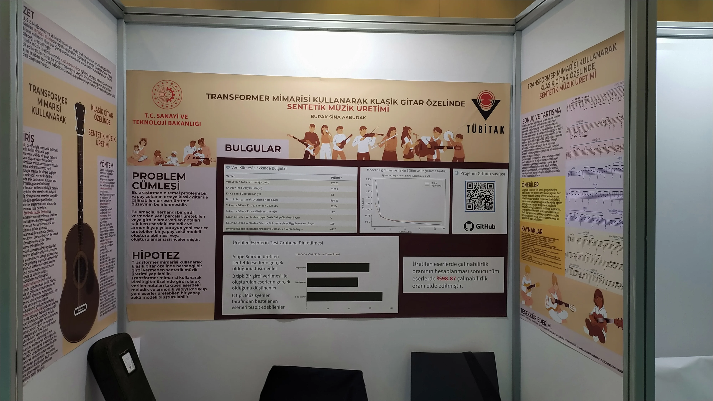
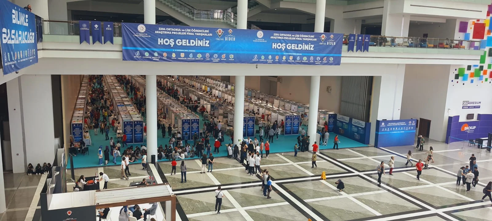
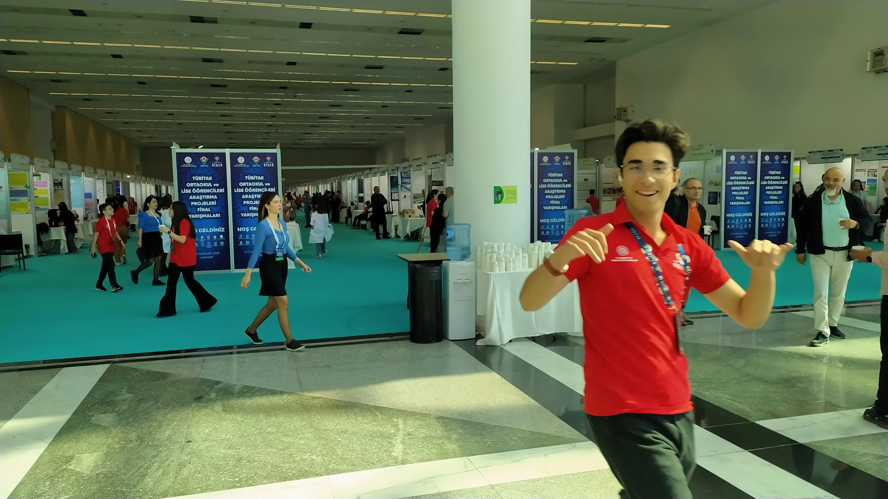
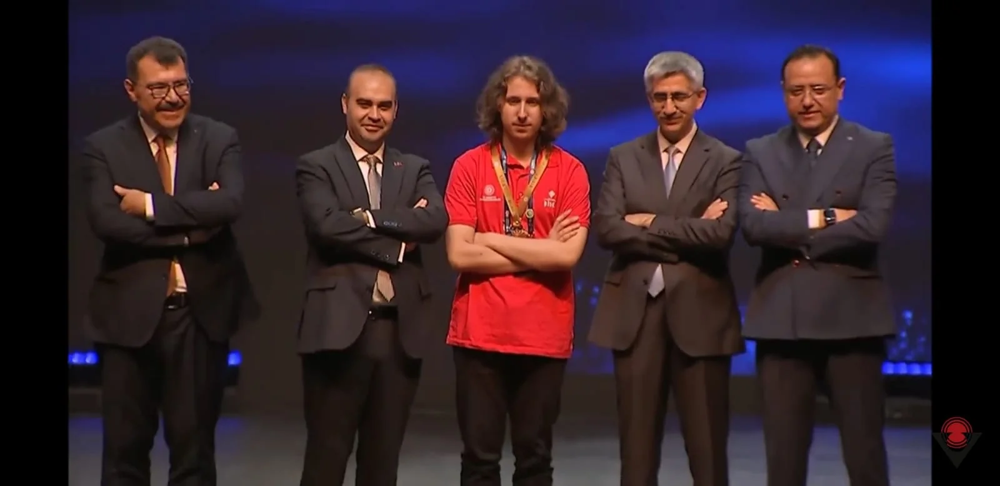

## Gün 0 - Cumartesiyi Pazara Bağlayan Gece

Otobüs. Binmeyeli çok olmuştu. Ama tekli koltukta oturmak keyifli, beklediğimden geniş. Gitarı Hakan Hoca'nın yanına attım. Güvenli duruyo gibi. Durumlar iyi. Tahminimce uyurum az sonra. Veya Paris yolcuğu gibi Skyrim albümü mü dinlesem yoksa? Zor soru.

Skyrim albümünü bitirdim valla. Sonrasında Hiromi dinleyeyim dedim ama gece için too much jazz.

## Gün 1 - Pazar

Sabah kahvaltısı yokmuş ondan dışarı çıktık kahvaltıya. Leylekle pizza girdik. Kaliteliydi baya. Sonrasında orayı burayı gezdik baya bi. Büyük büyük marketler vardı. Pazar kavramının büyükşehirlerde tam manasıyla bitmiş olması çok ilgincime gitti, o büyük marketlerin içerisinde direkt esnaflar var resmen. Abiler torbalara sebze meyve falan atıyorlar böyle. İlginç durum.

Şimdi geldim dinleniyoruz. Biraz uzandıktan sonra bir daha sunuma bakarım herhalde. Sonra da akşam yemeği. Akşam herhalde son kez bakıp erken yatmaya çalışırız.

Direkt yemeğe kadar uyumuşum. İyi geldi ama dinlenmiş oldum. Yemek güzeldi, bi tık az almışım diye yine laf yedim.

Yemek sonrası biraz sunum çalıştım 3 kere bi döndüm. Baya bi gitar çaldım.

## Gün 2 - Pazartesi - Serginin Başlangıcı

Sabah alelacele kahvaltı. Şimdi geçtik otobüse. Bi tık daha iyi planlanmış olabilirdi bu kısımlar ama problem değil.

Sabahtan yan sıradan güzel bir arkadaşla tanıştım, elektro gitarist. Muhabbeti hoş. Rakibim olmasına rağmen ego sezmedim. İyi bi adam gibi.

Rakiplerimden elemanlar geldi bi. Dandirik dandirik sorular sordular. Küçümser bakışları vardı gibi veya korktular emin olamadım. Bir ara gidip o elemanları sıkıştırsam iyi olcak.

Geçen sene fizik yapan İYTE’te tanıştığımız adam bu sefer buraya gelmiş. Eren ismi. Güzel hoşsohbet bir adam. O ve bir arkadaşı ile takıldık. İkisi de pianist. Müzik teori üzerine konuştuk vs. Keyifli. Bir de bas gitaristim diyen bir adam vardı. İlk sorduğu şey root posizyonlarına dikkat edip etmediğiydi. Teoriyle ilgilendiğini de söyledi zaten. Bir de Asturias çalıyordum birilerine. Ortaokullu bir kız çocuğu gelip bu Isaac Albeniz’in Asturias’ı değil mi ya falan yaptı. Komik olay.

Akşam yemeği vakti Leylekle sıra ararken bi baktık Erenlerin yanı boş. Dedim geç şu elemanların yanına. Bir de bir eleman daha vardı Eren’in yanında.

Akşam asma katta Leyleklere takıldım baya bi saat falan. Ben onların sunumlarını dinledim, onlar benimkini dinlediler. Akıl yürüttük biraz neler yapılabilir vs. diye. Yararlı oldu sanırsam. Birkaç noktayı kısalttım. Yarın devamını da getiririm zaten.

## Gün 3 - Salı - Sunum Günü

Sabahı kaçırdım, kötü oldu. Pek uyuyamadım zaten. Özellikle sabah kalkınca kalkmakla kalkmamak arasında kaldım hep. Zaman var yat, ama canım istemiyor yatmak vs. Neyse vakit ilerledi de inebildik yemeğe.

Güzel bi sabah kahvaltısı yaptık. Abimin marketten almayı önerdiği fındık taneli çikolatadan denedim, güzeldi baya. Neyse işte yedik bir şeyler.

Yemeğe kıyafetlerimizle gitmiştik zaten, dün verdikleri kırmızı tişörtler. Sevdim baya, giyerim sonra da. Bi de gömlek var da, onun pek kullanım alanı yok gibi. Neyse düşünürüz sonra nerde kullanacağımızı.

Müzik sektöründe LSTM kullanan bi abi geldi. Adana BİLSEM’denmiş eleman. LSTM baya kötü sonuç vermiş ama. Bölgeyi geçip finale kalamamışlar. Üzücü olmuş adamlar için. Ama şöyle bir nokta var ki 2204A’da sentetik veri üreten yok varsayımımı kırıyor bu durum. Var ama oldukça kötü.

Jüri sunumlarının olacağı dünden söylenmişti. Ancak yazılımın ertesi günü olma ihtimalinin daha fazla olduğunu düşünmüştük. Öyle olmadı, bugün sunumlarımızı yaptık. En azından ben ve odada beraber kaldığımız alt dönem sundu, Leylekler yarın suncak.

Sabah geldik standa, bir baktık etrafta takım elbiseli çantalı adamlar dolaşıyor. Jürilermiş meğersem. Benim bölgede sanatçı hoca buraya da jüri olarak gelmiş. Sabah dolaşırken diyorum ki bu adam tanıdık. Meğersem oymuş, standa gelince öğrendim. Yanında da bir eleman daha vardı. Eleman çok soğuk bir tipti; stantta anlatırken de çok ilgilenmedi, sunumda da soru sormadı direkt. Biraz şüphe uyandırıyor bu durum bende çünkü iki tarafa da çekilebilir bu durum. Sunumda pek bir hata yaptığımı düşünmüyorum. Sorulara da adamakıllı cevap verebildim. Beklediğim yerlerden pek bir soru gelmedi. Daha kolay sorular geldi genel olarak, cevapladım geçtim. Neyse işte, sonucu cuma günü öğrencez.

Sonrasında full lise matematik falan baktım. İnanılmaz çöp hepsi nerdeyse ya, ne yalan söyleyeyim. Bi tek TAKEV tayfadan matris projesini dinleyemedim, kız o kadar chill ki standı tüm gün boş. Onun dışında harbiden de elle tutulur bir şey yok. Ortaokulların matematik projeleri çok çok çok daha keyifliydi dinlemesi. Liseler harbi sıkıcı o konuda.

Bi de rastgele (sayılır) sosyoloji, değerler eğitimi ve edebiyat dinledim birer tane. Abi bi tane dinledim oke, ikinci bir taneyi daha dinleyebileceğimi düşünmüyorum. Bu alanlar genel olarak hiç benlik değil. Bi tane kimya dinledim 9’lardan. O, o kadar da kötü değildi.

En son da TAKEV tayfa ile ortaokul projesi gezdik. Bir biyo, bir kimya, bir fizik baktık. Özellikle biyodaki 3 kişiden ikisi kız ve inanılmaz diksiyonlu falan böyle. Maşşallah diyorum hocam. Dinlemesi keyifliydi, biraz daha güzel sorular sormak isterdim.

Genel olarak bu şekilde. Serginin bundan sonrası baya sakin zaten. Gezcek pek bir yerim kalmadı, birkaç arkadaş daha edinmeye çalışcam. Bizim yanımızdaki elemanlarla arkadaşlık kurmaya çalışcam bi. Kurdum da, ilerletesim var. Ordaki elemanlar baya temiz elemanlara benziyolar. Bikaç tane daha eleman var yazılımdan aslında da, onlarla pek yanaşmıyorum arkadaşlık kurmaya. Nedendir bilmiyorum. Neyse yarın bakarız.

Az sonra bi asma kata Leyleklere giderim. Orda biraz takılıp sonra gelirim yatmaya. Bu şekil!

Ekleme: Akşam Leyleklerin orda olimpiyat baktım, sonra yattım harbiden de.

## Gün 4 - Çarşamba - Sergi Ziyaretçileri

Bugün gün değerlendirmesini yazmak için baya geç kaldım ama ertesi güne bırakmak da istemiyorum çünkü o zaman o gün ile çakışır ve üşenirim diye korkuyorum. O yüzden yazıp yatmayı düşünüyorum.

Sabah kahvaltıda biraz ortalığı karıştırdım. Ondan bundan deneyeyim derken bi tık ağır geldi açıkçası. Özellikle saf tahin yemesi zor bir şeymiş onu keşfettim.

Kahvaltının ardından standart prosedür olarak sergiye gittik. Yollar aynı, ilk hamleler aynı genel olarak. Bugünkü amacım son birkaç sergiye uğramak ve birkaç yeni tanıştığım insanla daha da kaynaşıp takılmaktı. Öyle de yaptım diyebilirim. Sabahtan baya bi stantta durdum. Ziyaretçim baya yoğun, özellikle tavuk projesiyle karşılaştırıldığında. Gerçekten farklı farklı insanlar gördüm sergi boyunca. Oldukça mutluluk verici. Ve bir noktadan sonra sergi sunumumu neredeyse mükkemmele yakın yapmaya başladım. Her cümlem ve kelimem seçilebilecek en iyileri olmaya başladı gibi hissettim açıkçası. Gerçekten de zibilyon kere anlatınca aynı şeyi iyi oluyormuşsun. Öğretmenlerin anlattıkları konulara bu kadar hakim olmalarının nedeni bu aslında. Şimdi anlıyorum.

Sabahtan bir de yaklaşık 1 dakikalık videomuzu çektiler basından abiler. Daha doğrusu pirim tek başına kartının üzerinde CD kalemiyle “BASIN” yazılmış bir şekilde elinde kamerası, kulağında kulaklığı herkesin sergi sunumunu çekmeye çalışıyordu ve eninde sonunda bize de geldi. Biraz çalıştım üzerine vs., sundum geçtim. Temizdi sanırsam.

Bir sürü ziyaretçinin ardından, öğlen yemeği molası geldi hızlıca. Güzel bir yemeğin ardından biraz Leylekle takıldık. Sonra bir ara TAKEV tayfadan elaman gözüme çarptı, biraz onla gezdik falan. Birkaç projenin ardından da geldik bizim masaya calc muhabbeti yapmaya başladık. Eleman uzun süredir calc çalışıyormuş, yeni şeyler öğrenmiş falan onları anlattı. Keyifliydi.

Tabi onlarla takılırken birkaç ziyaretçi falan da geldi. Onlara da anlattım haliyle. Ama ziyaretçilerden biri geçen sene ISEF’e giden elemanlardan 2 kişiydi. Alanları tahminimce yazılım. Serginin ilk günü de gelmişlerdi aslında ama bu sefer ellerinde notlarla falan geldiler. Güya ISEF için yeterli misin falan onu ölçüyorlarmış. Başkalarına salak salak sorular sormuşlar burnu havada herifler. Bana çok bir şey soramadılar çünkü ya çok iyi anlattım ya da adamakıllı anlamadılar. Bilmiyorum açıkçası. Bakacağız.

Öğleden sonra Hasan Mandal ve Ursavaş geldi. Ursavaş hocalarla 2-3 saatlik bir konferans yaptı. Sonrasındaysa Hasan Mandal bizimle 1 saat kadar takıldı. Güzel şeyler anlattı genel olarak. TÜBİTAK’ın yaptıklarından bahsetti falan. Sonra salak saçma bir soru cevap yaptı. Ortaokullar abi ne diyebilirsin ki.

Otele biraz daha geç geldik haliyle sunum konferans yüzünden. Yemeğimizi yedikten sonra ne yapalım ne yapalım diye saatlerce düşünüp dışarıda yürüyüş yapmaya karar verdik. İki üç tur atıp marketten bir şeyler aldık ve aldıklarımızı otele gelip asma katta hikaye oyununu oynayarak bir güzel nam nam ettik.

Yarın gezi. Bakalım nasıl olacak.

Ekleme: Sanırsam bugündü ama yazmayı unutmuşum, İFL 2002 mezunuyla tanıştım. Merak ediyorum ben de büyüyünce lise sergilerine katılıp İFL’li görebilecek miyim.

## Gün 5 - Perşembe - Ankara Turu

Her sabah kalkış saatimiz yarım saat falan oynuyor. Bu sabah da biraz geç kalktık. Gerçi daha da geç kalkmayı düşünüyorduk ama benim oda arkadaşı biraz daha erken kalkmak zorunda olduğundan ben de erken kalktım. Bir de sanırsam klima çarptı biraz, sabah boğazımız ağrır halde kalktık. Hala tam olarak yerinde değil.

Buradaki sabah kahvaltılarından biraz daha yersem gerçekten şişmanlayacağım gibi hissediyorum. Aslında daha sağlıklı beslenmek gibi bir opsiyonumuz var çünkü bissürü meyve sebze falan var ama insanın canı istemiyor. O yüzden artık bu maceranın sonuna gelsek de adamakılı yurt rutinine dönsem diyorum açıkçası. Her ne kadar iyi güzel hoş olsa da bir yere kadar. Burada bir rutin oluşturmak lazım ama gerek yok gitcez zaten.

Kahvaltının ardından atladık otobüse Millet Kütüphanesi’ne gittik. Oldukça güzel mekan. Kocaman bir bina. İçinde baya da kişi var. Ücretsiz yeme içme hizmetleri falan da var. Bol bol kitap var tabi. Eğer olur da Ankara’da okursam bol bol uğradığım bir mekan olmasını isterim açıkçası.

En son da Medeniyetler Müzesi’ne gittik. Anadolu’da yaşamış farklı medeniyetlerin eşyalarının bulunduğu bir yer. Orası da çok şahaneydi. Büyüleyici figürler vardı gerçekten de. İleride bronz, taş ve seramik temalı 3D printed figürler basarsak referans olması açısından bol bol fotoğraf çektim. Hatta bir tanesini profil fotoğradım yaptım, yarım yüzlü bir abiyi. Baya güzeldi burası.

Geziden güya 17.30’da döncez cart curt dediler 15.40’da falan döndük. Biz de hocalarla bir market alışverişine çıktık. Akşam film gecesinde yemelik bir şeyler. Hatta arkada filmi indiriyorum şu an. Şimdi biraz dinleniyorum.

Akşam film gecesi. Tek bir hocamla kaldık izlemeye. Millet kaçtı. Sanki herkes film izlemek istiyodu. Özellikle şu anda yanımda bulunan *Leylek* hiçbir zaman istemedi. Sonrasındaysa TAKEV tayfayla 2 saat falan muhabbet ettik. Keyifli vakitler.

## Gün 6 - Cuma - Ödül Töreni

Sabah kalktık. Pek uyumadık aslında ama uykum da yok. Dün öğlen uyumamdan kaynaklı olsa gerek. Geç çıktık odadan aslında ama asansöre binemeyip 8 kat boyunca merdivende bavul taşımaktan başka bir problem olmadı diyebilirim. Otelden çıkışı gerçekleştirip kahvaltı yaptık. Diğer günlere nazaran iştahım daha da yoktu. Yedim yine bir şeyler.

Şimdi alana geri geldik. Makamlı adamlar gelirlerse onlara sunum yapmak için hazırda falan bekliyoz. Bekleyişteyiz.

>Leylek Köşesi: Merhaba ben leylek öncelikle buraya konuk olduğum çok mutluyum. ve kendilerine çok teşekkürlerimi sunuyorum. Çünkü bu saçma sapan insan ilişkileri arasında mental sağlığımı korumamı sağladın o7. Madem günlük yazıyoruz ben de bi şeyler yazayım. Genel manada günlerden bahsedeyim. Genel manada mental sağlığım ne kadar sosyal üstünlük kurduğuma göre değişiyor. Çoğunlukla bunu sağlamama rağmen bunu niçin yaptığımın bilincinde olmak bile bir çıkmaz sokak. İnsan düşünmekle edemiyor: Rasyonel bakınca kendilerini beni birçok dertten kurtardı. Yine de “not the best feeling”. Neyse. Saçlar gidiyor chat. yaklaşık 15 saat sonra.

Buradan sonrası otobüste bu haftanın yorgunluğunu bir nebze olsun atmaya çalışırken yazdıklarımdan oluşuyor. 2204A Final’i bitti, nasıl bittiğini anlatmaya geçiyorum.

Biz elemanları beklerken posteri falan yırtıyoruz. Tam o sırada ISEF’ten eleman geldi, bana soru soran adamlardan. Bu sefer telefon numaramı istedi. Muhtemelen derece alacaksın dedi. Onu diyince ben zaten 1.lik geleceğini anlamıştım açıkçası. Ama illaki insanın aklında acaba sorusu kalıyor, o yüzden o kalabalık salonda diğer alanların en sonunda açıklanan yazılımı beklerken yine de kalbin çırpıyor çok güçlü.

Takım elbiseli adamlar yalnızca ödül törenine geldiler. Bissürü süre de gelmelerini bekledik zaten. Kalabalık salona doluştuk, VTR’nin ve protokol konuşmalarının ardından ödüllere geçildi. Sanayi Bakanı’nın işi olduğundan önce 1.ler verildi. Yazılım okunurken İzmir dendi, sonrası zaten bizimkiler beni yumruklayarak sahneye uğurlaması. Keyifli. Hasan Mandalla fotom var, o konuda harbiden mutluyum.

Sonrasında Leylekler 2. oldu, bizim alt dönem 1. oldu. Salondan çıkıp TAKEV tayfayla foto çekildik. Kendi aramızda da çekildik tabi. Bu sırada İsmail Abi geldi dışarıya. Fotoların ardından bi cumaya gittik. Cumada Karaman il millî eğitim müdürü ile tanıştım falan, çılgın baya. Sonra AŞTİ’ye oradan da yemek yemeğe. Sonra geri döndük otobüse. Şimdi ise otobüste ilerliyoruz.

Yorucu bir 6 gün, keyifli bir 6 gün. Ama gerçekten de günün sonun inanılmaz bitti. Sanırsam mutluyum. Ama kafam da karışık. Üniversite seçimi olsun, ISEF olsun. Araştırmam lazım baya bi. Kendime iş açtım kfkfkfkdkd.

Bu başarıyı kazanmamda büyük rol oynayan ağabeyime, anneme ve babama ne kadar teşekkür etsem azdır. Ayrıca okul arkadaşlarıma ve okul yetkililerime güvenleri için de minnetarım.

Şükürler olsun.
