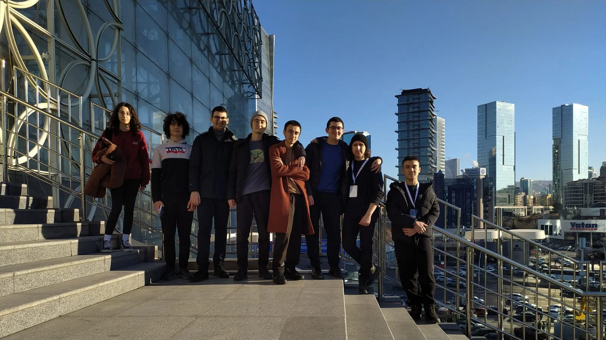

>Bu yazı yalnızca Türkçe olarak paylaşılmıştır.
>This article is published only in Turkish language.

Olimpiyat hayatımın son 3 günü.

# Gün 0 - Salı

Sabah otobüsü. Büyük hata. Hele otobüsle hiç değil. Otobüs sevmiyorum pek (o yüzden dönüşü trene aldım hatta). İlk başlarda azcık uyudum sonra biraz kod yazdım. Ömer'le baya bi oyun oynadık. Yolculuk bitti zaten.

Otele gelince önce odalarımızı ayarladık. Konuştuğumuz gibi ben, İsmet, Ömer. Sonra da az biraz dinlendik. Lobiye geçip Hitler attık uzun süre. Kampta tanıştığımız insanları gördük bir kere daha, onlarla selamlaştık, muhabbet ettik, oteli turladık. Bizimkilerden erken gelenler vardı zaten, onlar biliyorlardı biraz biraz. Ardından bizim üst dönemlerden bir arkadaş geldi bir ara, geleceğinden haberimiz vardı da ne zaman gelirdi emin değildik. Sonrasında yarın sınav var, dağılsak iyi olur deyip geçtik odalarımıza, daha doğrusu bizim odadan kovduk herkesi.

Nedense 1 haftadır falan sürekli konuşuyorum uykumda, uyuyamıyorum adamakıllı. Bugün de istisna değildi.

# Gün 1 - Çarşamba

Sabah kalktık, tabi sınav için heyecanlıyız. Lavaboya girdik iki üç kere. Son kontroller; uç var mı, pergeller nerede... İsmet, ben, Ömer üçlüsü zaten efsanevi bir üçlü. Okunmuş suyumuzu içtik, eşyalarımızdan emin olduk, indik aşağıya.

Sınav salonu *ko-ca-man*. Harbiden de sınav salonu. Hep tarif edildiği gibi uzun bir masa, solunda kekler, sandviçler; sağında çözüm kağıtları; ortada da su, olips vs. Gelir gelmez etrafı topladım tabi, kekleri en uzak köşeye, olipsleri falan da öyle; kağıtlar ve bana çalışacak alan. Kocaman projeksiyonlara saati açtılar: 4.30 saat. Kağıtlar dağıtıldı, başla dendiğinde başlanıldı. P1 ST, mutlu oldum tabi; P2 geo, gayet temiz; P3 sonlu, beklendiği gibi. Dağılım güzel ama sorular o kadar da değil maalesef.
Sınavda süre aktı zaten. Kek yemeyi düşünmedim hiç, elimden geldiğince sorulara uğraştım. Bitime yakın dedim Allah'ım inşaallah bizimkiler içinden geçmiştir ama maalesef onlar da patlamış. Moral bozmayın, daha ikinci gün var dedim elimden geldiğince ne yapayım başka.
Gariptir soru tartışırken kötü hissetmedim. Sanırım o kadar da önemsemediğimden kaynaklı. Bu bence iyi bir şey. Deneme sınavlarında da kötü hissetmeyi bıraksam iyi olur.
Anneler babalar İsmet'i ayarlamışlar, İsmet al sen çocukları gezdir, yedir içir. Bir alışveriş merkezi varmış, İsmet gezmiş daha önce sanırım oraları. Biz de girdik, önce bi yemek yedik. Sonra gidip saatlerce bilardo attık. Önce oynamak istemedim ama ısrar ettiler oynadım. İsmet olmasa oynamazdım zaten de, İsmet da best olduğu için keyifliydi yine de. Şakasız bir iki saat bilardonun ardından otele geri döndük.

Akşama doğru iki üç Hitler attık yine. Hitler çok sarmıyor artık bizi, ne de olsa 3 senedir falan oynuyoruz deli gibi, ama yine de âdettendir. Biraz oyun falan oynayıp yattık zaten sonra.
Gece uykusu şöyle böyle.

# Gün 2 - Perşembe

Gün 1 ile aynı aslında: sabah kalk, eşya hazırla, emin ol, sınava in. Gerçi bu sefer 12'de çıkış yapacaksınız dendiği için eşyaları güzelce topladık da çıktık odadan. İsmet'e eşyalarımızı lobiye indirme konusunda güvenip girdik sınava.
İlk günkü soru dağılımını bildiğimiz için ikinci günkü soru dağılımdan hemen hemen emindik: P4 sonlu, P5 AC, P6 geo. Elimden geleni yaptım ama ne yalan söyleyeyim bu günü pek beceremedim. Sonluya 2 saat uğraştıktan sonra sıkıldım, AC'ye bir şeyler yazmaya çalıştım ama çok iyi bir soru değildi. Geo da P6 geo, Melih Üçer geo olduğu için bir şeyler yazamadım maalesef.
Sanırım sınav hakkında üzüldüğüm tek şey, geolara adamakıllı bir şeyler yazamamış olmam. Onun dışındaki performansım ortalamaydı. 2. aşamaya ne kadar çalışabildim ki de daha fazlasını bekliyorum bilmiyorum. Tüm dönem ISEF için çalışmak durumundaydım. Tek başına proje yapmanın ve bir yerlere gelmenin sonucu her istediğine aynı anda yetişememek oluyor. 10 ve 11'deki çalışma da bu kadar yardımcı oldu zaten, onlar daha ne yapsınlar.
Bizim tayfa bugünden biraz daha iyi yaptı sanırım ama beklediğimizin altında kaldık hemen hepimiz. Canları sağ olsun, daha önlerinde baya bir yol var zaten.
Ardından zaten Ömer'lerin eve geçecek şekilde plan yaptığımızdan planı uygulamak üzere harekete geçtik. Ben, İsmet, Ömer ve Eray; önce saatlerce süren bir metro ve ardından bindiğimiz taksiyle beraber Ömer'lerin mekana geldik. Her ne kadar çok ısrar etseler de kalmadık orada, daha önceden satın aldığımız 20.00 trenine atladık.
Tren keyifliydi. Uyumak biraz zor tabi ama ben kesikli kesikli de olsa uyudum. Film izledik, kod yazdım, oyun oynadık baya bir. Geçti 12-13 saat bir şekilde.

# Gün 3 - Cuma

Sabah uyanınca ISEF için iki üç kod yazdım yine. İnince de metroya geçip vedalaşıp onlar evlerine ben okula geldim. Her ne kadar olimpiyat kariyerim sonlanmış olsa da ben şu anda da içinde bulunduğum şu olimpiyat odasını gerçekten çok seviyorum. Her şey, burada yaptım, yapmak istedim, yapacağım. Böylece görünürde çok da bir şey ifade etmeyen ancak benim için anlamı büyük olan olimpiyat kariyerimi sonlandırdım.
