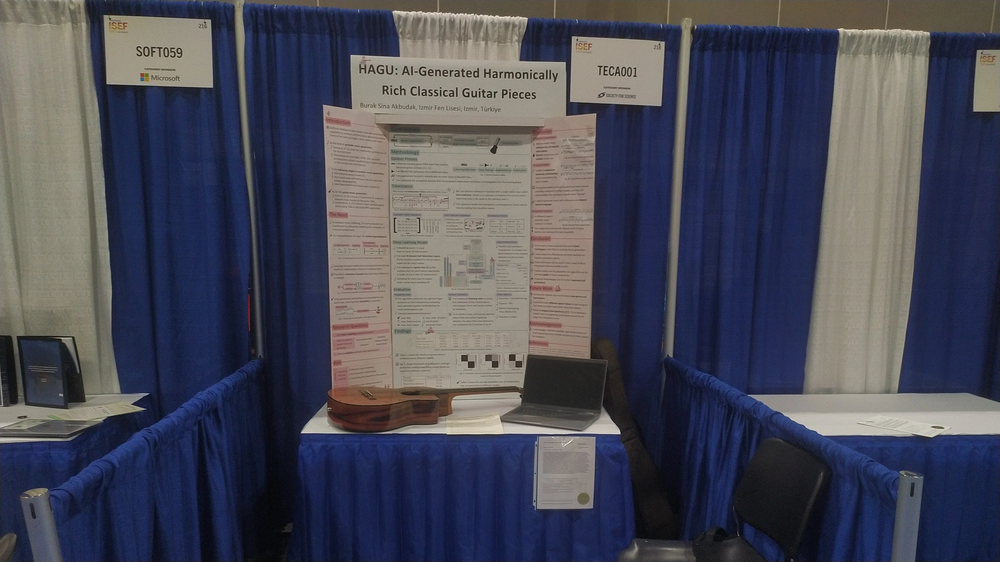

Gerçekten de vakit geldi.

# Gün 1 - Yolculuk

Sabahtan şükür problemsiz geldik havaalanına. Bir saat kadar falan bekleyeceğiz.  

Kontuardan çağırıldım. Makara olay. ISEF takımından birini çağırmak isteyip beni çağırmışlar ama özel değil.

Gitarı koyarken sıkıntı yaşamadım. Direkt kabin bagajı olarak yer vardı ama Amerika uçağı için aynı şekilde olacağını düşünmüyorum.

İGA'ya geldik. Bıraktığımdan beri hiç küçülmemiş, hala acayip büyük. Zaten uçak park etme pozisyonuna gelene kadar 20 dakika falan geçti.

LA uçağını beklerken pek de bi şey yapmadık. Hızlı geldi zaten zaman. Muhabbet sohbet falan filan. Su doldurdum iyi oldu.  

Uçağa bindik şimdi. Gitar üst tarafa sığmıyor. Şu anda bacağımın arasında ama hostesler yardımcı olacaklarını söyledi. Bakalım.

Gitarı koyabildim şükür. Bindiğimizden beri 15 dakikadır falan bacak aramda düşünceli bi şekilde koyacak yer var mıdır diye düşünüyordum. Şimdi binme işlemi bitince boş kalan büyük yerlere koyabildim sıkıntısız.

Sanırım az önceki menüyü daha önce de yedim, muhtemelen Brüksel'e giderken. Güzel menü.  

Saçma uzun bi yolculuk gerçekten de. Hazırladıklarımın büyük çoğunluğunu (2 filmden birini, calculus çalışmasını, coğrafya kitabını, indirdiğim albümlerden birçoğunu) bitirdim ama hala iki saat var. Sanırım ikinci öğünümüzü yiyip biraz daha sunum çalışıp müzik dinleyeceğim. İnşallah sağ salim otele varabiliriz.  

1-1.5 saat geçişte bekledik. Şimdi valizleri aldık but at what cost. Azcık dinleniyoruz kenarda, bizim elemanların çoğu yukarda hala.  

Yatma vakti.

# Gün 2 - Alışveriş

Sabah kalkıp duş aldım bi. Oda arkadaşım iyi bi adam. Çok konuşmadık zaten yorgunduk.

Aşağıya inip kahvaltıya gitmeyi bekliyoruz.  

Kahvaltıda ayıptır söylemesi oreo'lu waffle yedim. Dedikleri gibi porsiyon büyük. Doydum doymasına da çok sağlıklı bi kahvaltı değildi haliyle. Bol şeker.  

Önce otele geçip bi yarım saat sergi açılıncaya kadar bekledik. Sonra geç kalanları bekleyip Convention Center'a geçtik. Center'ın önünde beklerken Ukraynalı bi elemanla takıldık. Pasaport ve kayıt formunu verip kayıt için bekliyoruz.  

Kartlarımızı ve badge'lerimizi aldık. Güzelce koydum, inşallah kaybetmem. Ufak çanta da var, chill.

Şimdi TÜBİTAK görevlileri ve birkaç arkadaşla beraber uber çağırıp outlet'e gidiyoruz. Sohbet muhabbet ve etrafta gezmece.  

Corridor Digital'in yanından geçtik. Tam göremedim binayı ama o mahalleyi gördüm ve gerçekten direkt videolardaki gibi. Baya güzel.  

Rahat bi uber sürüşünden sonra geldik outlet'e. Gerçekten direkt Forum Aydın. Outlet mantığı bizimkiyle aynı. Cumartesi olduğundan kalabalık biraz.  

Leylek istedi diye yazıyorum, Swarovski'den annesine kolye aldı. Böyle.  

Alış veriş kısmı sıkıcı. Elektronik mağazası yok, bi ara belki Best Buy'a götüreceklermiş. Oradan alabilirim umarım kulaklığımı. Şu geçtiğimiz zaman diliminde boş boş bizimkilerleyim. Az sonra akşam yemeği. 

Açım. Şarjım da 5. Kötü oldu.

# Gün 3 - Sergi Hazırlığı

Dün gelir gelmez yatmışım. İki üç sesli mesaj atıp bayılmışım. Dümdüz alışveriş merkezi günü pek benlik değil.

Akşam 20.30'da yatınca haliyle tüm gece uyuyamıyorsun. 04.30 gibi kalktım yeterince uykumu almış olarak. Dedim önce bi lavaboya girip bizimkileri arayayım. Tam 2 saat oldu milletle konuşurken. Sırasıyla annemi, abimi, bizim yurttaki elemanları sonra babam uyanınca bi tur daha anne babayla konuştum. İyi oldu. Bi daha vakit bulamam muhtemelen. Bakalım hayırlısı. Bi iki saat var daha otelden çıkmamıza. Sunum çalışcam sanırım. Sonra kahvaltı ve alana gidip poster asmaca.  

Çoook fazla şey oldu. Hızlı hızlı yazıyorum. Alana geldik, posterlerimizi astık ilk. Orta kısmı batırdım önce ama sonra çıkartıp hallettim bi şekil. Tek başıma yapmamalıydım ya. Allah'tan sonrasında Nisayla yaptık bi şekil. Poster tamamlandıktan sonra HUB'a gidip check-in yaptık ve inspection için beklemeye başladık demek isterdim ki HUB'dan döndüğüm anda initial inspector geldi. Hatta daha özetimi falan pinlememiştim masaya. Sağ olsun yardımcı oldu. Çok sakinler, adam bende bi 15-20 dakka durdu, en azından bana öyle geldi. Sonrasındaysa ikinci inspector geldi. Yaşlı ama tonton bi teyze. Ardından gitarı ve laptop'u qr'ladım. Girer çıkarken okutuyorsun hep. Böylece tekte inspection process'i geçtim.  

Ardından su doldurup yemeğe gittim. Cheese pizza alıp geçtim, sabah hemen hemen hiçbir şey yememiştik, iyi geldi dolayısıyla.  

Sonra kariyer fuaro başladı. Pasaport dedikleri bi muhabbet var. 10 tane gruptan stamp alıyon. Hepsini bi saatte topladım. Salak gibi belki bi saat götürmem gereken yeri aradım ama aynı yerdeymiş halbuki. Neyse onu da hallettik. İnşallah 25$ kazanırım ISEF Store'dan. Tişört falan alırım belki bilmiyorum.  

Danimarkalı arkadaşım geldi. Tam bi journalist ablayla konuşurken geldi. Sonra yanına gittim azcık sohbet muhabbet. Bi ara pin exchange olacak. O zamana kadar boşuz baya. Gitar çalacağım herhalde. Güzel bi etraf videosu çektim, onu yollamam lazım gruplara ve insanlara ama internetim yok. Bi türlü bağlanamıyorum.

Pasaport muhabbetini kazandım! Leylekle gittik. Önce dedik ki kupa alalım 3 tane. Ama bizim kategorinin kupası yokmuş. Sonra bi tane tişört aldım. Cool baya. Aslında daha da güzeli varmış ama bitmiş ya. Gelmicekmiş de sonra.  

Etrafta boş boş takıldık. Keşke başka projelerle sosyalleşseydim. Hata ettim.  

Akşamına pin exchange. 1600 kişinin buzlarını kırmak pek de mümkün değil. Gürültülü zaten ortam, pek mümkün değil adamakıllı muhabbet etmek. İlk bir saatte tüm Türkiye pinlerini dağıtıp çıktık Leylekle. TÜBİTAK ekibiyle oturduk, muhabbet vs. Sonrasında da geri dönüp direkt yattık zaten. Yorucuydu.  
  
# Gün 4 - Sempozyumlar

Sabah kalkıp kahvaltı yapacakmışçasına aşağıya inip kahvaltı etmedim. Bizimkilerle konuştum azcık. İlk giden grubu kaçırıp ikinci grupla gittim alana.  

İlk iş olarak Türkiye bayrağıyla fotoğraf çekildik. Güzel his. Seviyorum temsil etmeyi ülkemi. Ardından da sempozyumlara gittik.  

İlki jürilerin değerlendirmesiyle ilgiliydi. Güzel sunum. Notlarım:  

>Elevator pitch is about 30 sec.  
>If the scheduled judge doesn't come, say it to the cochairs.  
>Printed name has the priority when two judge comes.  
>Judges shouldn't go away after 5 mins.  

İkincisi bir üniversiteye nasıl başvurulur ile ilgiliydi. Notlarım:  

>"I hope the most important thing about me is not Yale."  
>If you have an interdisciplinary person, you don't need to think about one of the discipline will overshadow the other. "Put yourself onto the table."  
>Your interest can and will probably change.  
About the questions: it's okey to ask y'now. We won't remember it after reading.  

Üçüncüsü ise essay yazmak üzerineydi. Notlarım:  

>Anxiety: "My essay won't stand out."  
>Why even essay: "You are more than your GPA."  
>"Essays are not resumes. We already have your resume. We look for stories and experiences."  
>"Let your personality shine. If you are funny, write an essay that has jokes in it."  
>"Multiple people looks at your application. We literally project your essay into wall and read it with 3 officers, DA and a faculty member. We care!"  
  
Sonrasındaysa alana geçip biraz sunum çalıştım. Bizimkiler geldi gitti vs. Yemeğe gitmedim bugün. Yesem yerdim de canım istemedi. Sempozyumlar sonrasında saat zaten hafiften 15.00 falan oldu. BestBuy'a gitmeyi teklif ettim TÜBİTAK görevlilerine. Yarın gitsek daha iyi olur dediler, açılış törenine yetişmesi sıkıntı olacak öbür türlü. Vardır bi bildikleri deyip ısrar etmedim.  

Önce otele gittik alandan, bir saat gitar çaldıktan sonra da açılış töreni için gittik alana yeniden.

Açılış töreni için sıraya girdik ardından bizim arkamızdan sıra o kadar uzadı ki. İyi ki erken gitmişiz ki biz gittiğimizde bize hiç erken gözükmemişti. Anlatcak pek bi şey yok. Güzel, düz hype. VTR'ler falan da sönüktü bence he tekrardan düşününce. Önemli değil ya, asıl önemli olan ödül töreni. 
  
# Gün 5 - Student Mixer

Sabah erken uyandım. Yeterince dinlenince farlar açılıyo babamın tabiriyle. Aklımdaki birkaç soruyu araştırdım, onları not ettim.

İlginçtir ki bu sefer 15 dakika bekleyip gitmedik, bi 2-3 dakikalık gecikmeden sonra çıktık otelden. Bugün VIP'ler ve Sponsorlar gezeceğinden millet business atire giyinmiş. Ben düz ISEF tişörtü giydim, np diye düşünüyorum.  

Alana varınca sıkıntılı projeleri içeriye aldılar, son kez bi D&S attılar. Sonsuza giden bi sırada beklemektense kenarda oturduk. Ardından içeri girip mekanımıza geçtik.  

Oturup gitar çalarken iki üç ilgili kişi geldi. Azıcık sundum, muhabbet sohbet falan. Ardından TECA tayfayla takıldık biraz. Hepsi Amerikalı olduğu için kültürleri benzer, konuştukları şeyler benzer, fikirleri benzer. Uzak kaldım biraz. Sanırım Avrupalılarla aram daha iyi genel olarak.  

Ardından dışarı çıktık (çıkmak için bile bekledik baya). Bizimkilerle buluşup çok da keyifli olmayan bi panele geldik. Biraz dinledikten sonra çıktık dışarıya.

Panellerden sonra BestBuy'a gitmek için otele geçtik. TÜBİTAK görevlisi ile ayarlamıştık, birkaç saat içerisinde gidip geldik. Kulaklığıma kavuştum şükür.

Sonrasında da Student Mixer vardı. Parti falan. Ondan öncesinde verilen akşam yemeği güzeldi baya. Biraz Danimarkalı arkadaşım ile muhabbetten sonra otele geçtik arkadaşlarla. Artık "otele gitmek için danışman öğretmene ihtiyacınız var" makarası dönmüyor. 4 kişi geçtik otele. Dönüş yolunda da yaptığım işle ilgilenen bir Türk ile karşılaştım. İleride bir daha konuşmak istediğini belirtti. Otele varınca odaya çıkıp son kez sunum vs. bakıp iki üç sesli mesaj yolladım bizimkilere.  

# Gün 6 - Sunum Günü

O gün bugün. Sunum günü.

Sabah kalkıp duşa girdim bi. 7.15 çıkış demişler, Allah'tan doğru tahmin etmişim de yatarken, 06.30'da kalktım. Hazırlanıp aşağıya indik, 7 dakikalık bir gecikmeyle LA Convention Center'a vardık.  
Uzun sırada biraz bekledikten sonra içeri girdik. İlk 1.30 saat special award judge'lar dolaşıyor. Bana uygun yalnızca bir tane special award var (TÜBİTAK hariç) dolayısıyla birilerinin gelmesini pek beklemiyorum açıkçası.

Masanın üzerindeki kağıdımda 9 tane jüri gözüküyor. No-show'lar ve ekstralar olduğundan gerçekten de 9 tane gelir mi emin olamıyorsun. Bakalım hayırlısı olsun. Şahsen tek istediğim işlerin yolunda ve güzel gitmesi. Gerçekten şu an kazanmayı veya kazanamamayı düşünemiyorum. Hayırlısı neyse o olsun.

Special award düşündüğüm gibi gelmedi ilk 1.30 saatte. İlk jüri sunumuma da bi yarım saat var. Bakalım.  

Kategorimin kurulmasında öncü bir adam geldi. TECA'nın jürisi normalde ama benim jürim değil. Güzel bir konuşma geçti aramızda.

Yine boş vakti olan biri geldi. Baya güzel geçti o da. *Excellent English* olmadı belki pek ama güzeldi ama.

Bir jüri daha. İyi bi adamdı bence. Çoook fazla human evaluation sorusu sordu. Cevapladım hepsini, inşallah aklına yatmıştır. Percentage-wise data istedi çok. Confusion matrix'ler yerine percantage tarzı bi şey sunsam daha iyi olabilirdi belki bilmiyorum.  

Bi jüri abla geldi, east music singer. Güzel bi konuşmaydı. Güzel sundum bence. Farklı uzunluktaki sunum ister misiniz sorusunu seviyorlar. Bi önceki jüri da söylemişti.

Tam öğlen yemeği öncesinde bir jüri geldi. Tam bir Amerikalı tipi var. Geldi, ben daha ağzımı açmadan saçma sapan şeyler söylemeye başladı. Postere baktı biraz, sonra kendi çocuğuyla alakalı şeyler söyledi. Daha sunum yapayım mı falan diye sormadım bak. Sonra başına gelenler hakkında hikayeler falan anlatmaya başladı projeyle en ufak alakası yok böyle. Benim kalbim küt küt tabi, nasıl projeye bağlasam diye yer arıyorum ama bi o kadar da korkuyorum adamın beni kötü bellemesinden. Jüri en nihayetinde, adamın üstüne gitmek benim için dezavantaj. Neyse bi şekilde 15 dakika doldu. Hemen yan tarafta farklı bi TECA yarışmacısı yaklaştı bana ve dedi ki senin deneyimin de çok kötü müydü. Dedim evet ben böyle bi jüriyle karşılaşmadım hiç. Sonradan öğrendim ki diğerlerine daha da kötü davranıyomuş, o yüzden adamı şikayet etmişler vs. Zaten sonrasında şikayetler üzerine jürilikten atıldı, öğleden sonraki sunumlara gelemedi. Acayip garip adamdı.  

Öğlen yemeğinde cheese pizza yedim yine, baya güzel ve doyurucu. Biraz oturduk vs. Ardından öğleden sonraki sunumlara geçtik. 

İlk sunumumda aşırı ciddi bi adam geldi. Güzel geçti ama. Teknik bi adamdı, teknik sorular sordu.

Tam takılırken SAO jürilerinden elemanlar geldi. IEEE mi dedi AAAI mı dedi anlamadım. Yapay zeka projelerine bakıyorlarmış. Çok kötü sundum ya. Çok da umrumda değil de. Çok alakalı değillerdi zaten. İki üç hediye verip gittiler.

Şimdi sunduğum adam çok iyidi. Keşke daha iyi sunabilseydim dedim açıkçası. Tokenization'ı ayrıntılı açıklattı. 100 kere de anlatsam ayrıntılı açıklarken zorlanıyorum. Beğendi sanırım ama. İnşallah seçer beni abicim.

Şimdi 30 dakika aram var. 3 tane kaldı. Onu yaptıktan sonra bi 30 dakika daha. Ama sonrasında ardı ardına 2 tane var, aralıksız. İyi olacak inşallah onlar da.  

Garip bi abla geldi. Yalnızca gülerek dinledi. Türkiye güzel falan yaptı. Ne anlattığımı dinlemediğine eminim. Keşke daha kısa yapsaydım da daha erken gitseydi. En azından aşırı genel de olsa iki üç soru sordu. Intellectual property var mı, gelecekte neler eklenebilir. Böyle.  

LAPD polisine sundum. Çok garipti :).

Bi jüri ablaya daha sundum. Çok beğendi gibime geldi bilmiyorum neden. Seç beni abla lütfen.  

Sonrasında bi elemana sundum. Güzel gidiyordu genel olarak. Sonra dedi ki ne kadar çalıştın. Dedim 1 yıl. Az dedi. Daha da ilerlet dedi gitti. Limitasyonları sordu falan. İyi bi adamdı aslında ama öyle demesi beni üzdü. Neyse. İnşallah güzel olur.  

Şimdi otele geçip dinlenmece. Sonrasında Universal Studios. Valla çok halim kalmadı ama dinlenirim herhalde.  

Universal Studios için alelacele yukarı çıkıp üstümüzü değiştirip aşağıya indik. Ardından otobüse binip mekana gitmeye başladık.  

İndik dehşet aç bi şekilde en aşağıya indik. Önce Mario kart makarasına gittik Mario kart olduğunu bilmeden. Yemek bedava denince ordan alelacele çıkıp en yakın restorana gittik. Jurassic Park temalı mekanda tavuk+pilav yedik de ikisi de çok kötüydü. Bi de tatlı yedik, ben gocunduğum için istediğimden daha çok yedim valla. Sonra yukarıya azcık daha tok bi şekilde çıkıp etrafı gezdik. Hafiften biraz daha akşam oldukça hava soğudu, etraf karardı. Önce bi Harry Potter mekanına gittik, canımız girmek istemediği için girmedik açıkçası. Sonrasında ise rastgele dolaşırken dedik ki Universal Studios turuna mı girsek. Verdiğimiz en iyi karar kesinlikle. Adamlar öyle bir saatlik öyle bir program hazırlamışlar ki. 3D gözlük verdiler, kocaman setler hazırlamışlar onun için falan. Sular fışkırdı, ateşler yandı; tarihi olaylar dillendirildi, yeniyle karşılaştırmalar yapıldı. Baya baya baya iyidi. Ardından etrafta biraz daha yürüyüp Hogwarts'ın lavabosuna girip atladık dönüş shuttle'ına. Güzel akşam. Aşırı yorgun geldik ama nedense beklenmedik bi şekilde dinlenmiş olarak dönüyoruz. Yaşadığımız adrenalin ters teptirmiş olabilir bazı şeyleri.  
  
# Gün 7 - Halka Açık Sergi ve Özel Ödül Töreni

Sabah 5'te farlar açıldı. Dinlenmemiştim halbuki ama elim telefona gitti. Mesajlara baktım vs. bikaç kişiyle muhabbet. Sonrasında bi saat daha falan uyuyup yine dinlenmemiş kalktım. Zor geldi bugün otelden çıkmak ne yalan söyleyeyim. Yoruldum baya dün, yalnızca dün de değil de, genel olarak.

Sabah kurabiyemden yiyip geldim alana. Önce bi alana geçip TECA tayfa ile kahvaltı ettik. Dünkü jürilerden biri sunum yaptı falan. İyi adam. Film prodüksiyonu ile uğraşıyomuş ama Harvard mekanik mezunu falan. Güzel kariyer. Sonrasında bi ice breaker oynayıp fotoğraf çekildik. Ardından alana geri dönüp gelen insanlara sunmaya başladık.

Bi tane klasik kemancı geldi. Çok sağlam adam. Çok tatlı sorular sordu. AI ethics üzerine de genel olarak AI with music üzerine de.

Sonrasında bi grup geldi. Daha önce böyle grupla başa çıkmamıştım. 40'larında olan gençliğin neler yaptığını şaşırarak izleyen Amerikalılar. Takıldılar baya, sohbet muhabbet.

Yaşları bol bol değişken irili ufaklı bir sürü insan uğradı. Tabi gitar ilgi çekti baya.

Öğle vaktim oldukça garipti. Tam yanımdaki TECA arkadaşım dedi ki artık yemek vakti, daha önceden sonra konuşalım diyen Türk geldi, dedi gel yemek. İş yemeği tarzımsı bi şeyler yaptık kısacası. Fikirlerinden bahsetti. AI hakkındaki bakış açısı. Birkaç tane tokenizasyon yaklaşımı ortaya attı. Zaten daha önce düşünmüş olduğum şeylerdi o yüzden hızlı bi şekilde anladım/anlattım.

Yemekten sonra daha önceden geleceğini haber eden İFL'93 mezunu geldi bizim alana. Baya baya iyi adam ben çok sevdim şahsen. Dışardan bakınca acayip zeki bi adama benziyo harbiden. İçi de en az öyledir eminim. Şu anda UCS'te araştırmacı olarak takılıyomuş. Çok çok uzun zamandır Amerika'da, farklı yerler gezmiş falan. Aslında uzun kalmayı planlamıyomuş doktora için geldiğinde de, abi aile kurunca işler farklı oluyor herhalde. Birkaç konuda beni aydınlattı, daha doğrusu daha önce düşünmediğim birkaç konuyu dile getirdi. 

Onlarla biraz oturduktan, benim ve bizim diğerlerinin projelerini dinledikten sonra oturduk azcık muhabbet sohbet. Sonra bi baktım Whatsapp'a TÜBİTAK görevlileri demiş ki konsolosluktan eğitim ateşesi geliyor. Onları bulup stantta anlattım projeyi. İngilizce anlata anlata Türkçe bir şekilde projeyi anlatmak zor oluyor tabi.

Sonrasında dünkü jürilerden biri, daha doğrusu sabah bize sunum yapan jüri, 4 yaşındaki çocuğuyla geldi takıldı azcık. Çocuk durup dinlemiyo hiç haliyle. Neyse.

Ardındansa mezunumuzu uğurlayıp otele geri döndük. Aslında topluma açık sergi öğleden sonra da devam ediyo ama aşşşırı yorgunum o yüzden geri dönme teklifine hayır diyemedim. Güzel insanlar geliyo tabi ama gerçekten biraz dinlenmek istiyorum. Boğazım da uzuvlarım da artık daha fazlasını kaldıramayacak. Akşamına da özel ödül töreni için gitcez. Herhangi bir özel ödül almayı beklemiyorum. TÜBİTAK verse çok sevinirim ama vermezlerse da canları sağ olsun. Belki bi tan AI özel ödülü var, o gelebilir de hiç sanmıyorum. SOFT'ta falan da haliyle zibilyon tane AI projesi var, onlardan biri alır herhalde. Bakalım.

Akşam ödül töreni. Türkiye ortalama - ortalamanın altında bi ödül töreni geçirdi. Beklediğimiz 2 yerden gelmedi ödül ama olsun. Leylekler aldı Qatar ödülü. TÜBİTAK özeli alamadım ama canımız sağ olsun, bizim arkadaşlara gitti ne de olsa.  
  
Ödül töreninden sonra odaya geçip eşyaları topladım. Sonrası direkt yatış zaten.  

# Gün 8 - Ana Ödül Töreni

Sabah 05.00 gibi gözlerim açıldı nedense. İki üç mesaj attım, 05.30 gibi yatıp bi bi saat daha uyumaya çalıştım.

Ardından aşağıya iniş, check-out, valizleri valiz odasına vermece. Allah'ım inşallah gitara bi zarar gelmez. O kadar getirdim şükür sıkıntısız, bi zarar gelsin istemem kesinlikle.

Otelden çıkmamız aşırı uzun sürdü tabi. Çıkıp büyük ödül töreni salonuna geldik yeniden. Bundan sonrası hayırlısı.  

>Ankara Finalinde olduğu gibi yine bana ait bir köşe muhteşem. Sanırsam sadece küfür ederek konuştum. Ama npcannes şu an büyük an zarların atıldığı an. Hadi hayırlısı. En iyi dileklerimle.  -Leylek Köşesi

Heyecanlı bi ödül töreni. Sıralama 4-3-2- kategori değişimi-ardından 1.ler şeklinde. Her kategori geldiğinde bizden proje var mı diye soruyoruz. Güzel anlar.

Önce Leyleklere 2.lik geldi, sonra da bana. Ve ödül törenini noktaladık. Türkiye için çok da iyi olmayan bi sonuç. Dün aldığımız özellerle beraber 6 ödül. Daha çok vermediler. Neyse.

Garip oldu. Garip hissediyorum. Finalde olduğu gibi bi boşluğa düştüm yine. Ne hissetceğimi bilemedim. Özellikle dünkü bizim mezunun konuşmasından sonra. Biraz gözümde önemsizleşti herhalde. Her ne kadar daha önce üzerine düşünmüş olsam da, alırsam şu almazsam şu falan diye, planlarımın ve hayal ettiklerimin bi anda gerçek olmasını sindiremedim. Ödül törenlerini sevmiyorum, ödül alan kişi olsam da olmasam da.  

Şimdiyse dönüş. Saatlerce hatta bi gün falan yolda olcaz. Yolculuk yapmak uzun, sıkıcı ve özellikle yorucu. Bakalım.  

> Vay be. -Leylek

# Son Sözler ve Değerlendirme

**Etkinlik Değerlendirmesi:** Güzel etkinlik, kötü değil kesinlikle. Büyük, hem de çok. Organizasyon açısından gerçekten sağlam, herkes işini iyi yapıyor. Ama ilk günler oldukça sıkıcı. Bir sürü ilgi çekici olmayan sempozyum. Yalnızca bana veya bize öyle geliyor desem tamam da yok yani herkes için öyle, katılanların sayısına bakarak anlaşılabilir. Onun dışında saatlere uymaları, yardımcı olmaları, her şeyleri mail ve telefon uygulaması aracılığıyla haber etmeleri vs. güzel. Jüriler tatlı, konuşması keyifli insanlardı. En iyi ve güzel geçmesi gün iyi geçti yani bence.

**Bu etkinliğin bana kattıkları üzerine:** Geldiğime memnunum, ödül almış olsam da olmasam da (bunu ödül töreninden bir gün önce yazıyorum çünkü eve gittiğimde bir daha bu değerlendirmelerle uğraşmamam gerekebilir.) memnunum.

Amerika'yı erkenden görmek güzel oldu, en azından CA/LA'i. Biraz yapıyı anladım. İnsanlarını gördüm. Etkinlik boyunca da zaten bir sürü insanla sohbet ettim, uzaktan da yakından da yerli de yabancı da. Topluma açık olan günde aslında öğleden sonra o kadar yorgun olmayıp stantta dursaydım belki daha da çok tanışırdım da olsun o kadar.

Sunum yeteneğim ve dil yeterliliğim oldukça gelişti. Nerelerde takıldığımı nereleri güzel yaptığımı vs. daha da iyi gördüm. Dizayn ve poster hazırlamada başarılı olduğumu gördüm diğer katılımcılara nazaran.

**ISTF24 raporunda da yazdığım gibi:**
>Bana ülkemi temsil etme fırsatı verdiği için TÜBİTAK'a sonsuz şükranlarımı sunarım.
