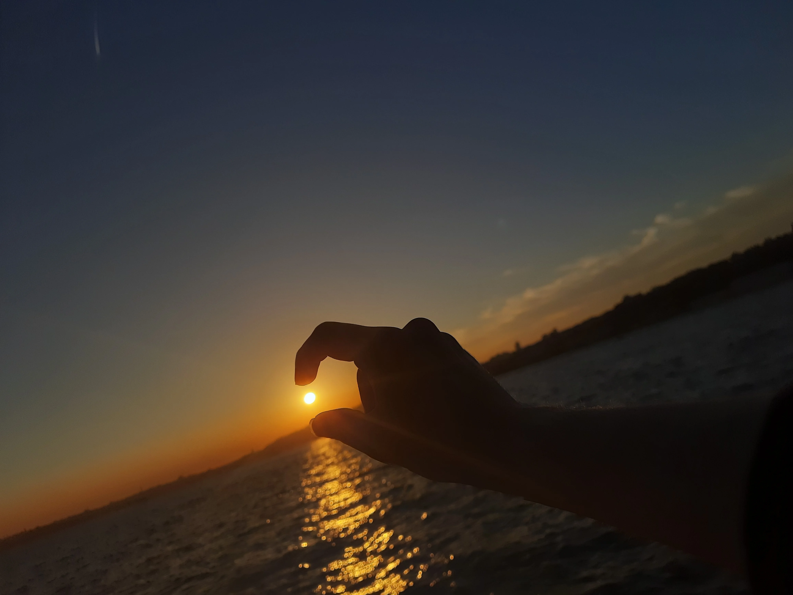

>Bu yazı yalnızca Türkçe olarak paylaşılmıştır.
>This article is published only in Turkish language.

## Gün 0 - Çarşamba Akşamı

Yolculuk hazırlığı. Bir halı sahanın ardından eşyaları toplayış ve filme dair son dokunuşları hallediş.

Yolculuk başladı. Uzun olacak ama keyifli olacak gibi.

İlk bir 20 dakika Ömer'le benim kulaklıkları hallettik. Allah'tan oldu. Sonrasında da 1 saat 15 dakika falan film izledik. Temposu biraz ağır, anlattığı da biraz durağan olduğundan dolayı sanırım çok da akıcı değildi. Sonra bitiririz diye bıraktık şimdilik.

Susurluk'ta ara verdik. Müzik dinlemekten başka bir şey yapmadık.
Biraz daha uyuma. Gözümüzü açınca kırmızı gökyüzüyle ve Marmara deniziyle karşılaştık. Baya keyifli. Şu anda bir yerde üst değiştirme molası verdik.

## Gün 1 - Perşembe

### Sabancı

Sabah kahvaltısını yaptık burada. Sonrasında 1 saatlik kampüs gezme zamanı verildi. Kampüs küçük zaten. Gezdik büyük bir kısmını, her ne kadar Ömer daha yarısına gelmedik dese bile. Ardından konferansa girdik. Çok kaliteli bir konferans değildi maalesef. Ama serbest ders seçme programından vs. bahsettiler. Amerika sistemi: "sen ne yapmak istediğin hakkında en ufak fikrin yok, gel ben sana göstereceğim". Bana göre olduğunu düşünmüyorum işte bu yüzden. Farklı öğrencilerle karşılaştırılman için 1. sınıfta herkes aynı dersi alıyor. Burslar bile bunlar üzerinden ilerliyor.

Sonrasında orada okuyan iki öğrenci ile soru cevap yaptık. Onlar da güzel şeylerden bahsettiler diyebilirim. Özellikle extra curricular aktivitelerden. Hobiler var, gece hayatı var, serbestlik çok fazla cart curt.

### Acıbadem

Acıbadem bi tık alakasızdı aslında. Ama yine de bence kötü değildi. Biraz fazla uzundu maalesef. Rehber abi iyidi ama. NLP+sağlık çalışıyormuş.

Acıbadem için tüm şehir kampüs gibi. Ama İstanbul'dan ne kadar kampüs olur emin değilim.

### Koç

Kampüs oldukça güzel. Her yer ağaç. Ama dediklerine göre ortam *soğuk*. Emin değilim, yaşamak lazım.

Otobüsten iner inmez EUCYS için beraber çalıştığım hocamın yanına gittim. Koç'un sitesinde yazan ofisinden farklı bir yerdeymiş ofisi. Taşınmış geçenlerde. Beni eski ofisinden oradan aldı, bi kahve ısmarladı sağ olsun. EUCYS ve genel olarak üniversiteler hakkında konuştuk. Sonrasında ofise geçtik. Orada da biraz NLP üzerine muhabbet, geçenlerdeki konferanslarıyla ilgili vs. konuştuk.

Sonrasında etrafı gösterdi biraz. Güzel mekanlar var: spor salonları, derslikler, yurtlar, öğrencilerin takıldığı yerler...

Ardından abimin bir arkadaşı ile takıldık az biraz. O baya negatif Koç'a karşı, yurt dışı (daha çok Amerika) git diyor. Dedim ama sarmadığını. Bilmiyorum. Koç'un negatif yönlerinden, soğukluğundan, EE'yi okutamadıklarından bahsetti baya.

Otele geldik. Güzel yemek yedik. Sonra yukarı çıktık dinlenmeye. Akşam bi Hitler öğrettik bizimkilere. Yarın akşam oynarız. Genel olarak durumlar iyi. Şükür.

## Gün 2 - Cuma

Sabah kalkabildik rahatça, bir problem olmadı. Güzel bir kahvaltı yaptık.

Ardından atladık otobüse Boğaziçi'ye.

### Boğaziçi

Boğaziçi. Keyifli mekan. Normalde abimin bir arkadaşını görecektim ama galiba haber vermeyi unutmuşum. Hastaymış da zaten. Görüşmedik kısacası. Sunumuna girdik, kötü bir sunum değildi. Tanıtım grubundan bi yaşlı amca anlattı baya bi şeyler. Öğrenme kadrosu, hangi bölümler var, kampüsün güzellikleri, burslar vs. Yurt problemlerinin deprem dolayısıyla olduğunu falan söyledi. Şu anda yeni bir yurt yapılıyormuş. Belki biz mezun oluncaya kadar yeni bir yurt yapılmış olur.

Sonrasında iki üç üst dönemlerle konuştuk. Keyifleri yerinde genel olarak.

Ardından Ömerle Bebek Sahil'e indik. Sahil keyifli olay. Her ne kadar yüzmeyi falan sevmesem de sahil muhabbetlerini seviyorum gerçekten de. Sonrasında bir çılgınlık yapıp fenikülere bindik. Half Life vibes... Oradan Boğaziçi'nin kuzey kampüsüne geçtik. Oradan da aşağıya bir daha. Üstlerle biraz daha takılıp oradan otobüse atladık İTÜ'ye gitmeye.

### İTÜ

İTÜ'ye erken indik çünkü boş vakit verip öğle yemeği yemeye izin verdiler. Biz cuma tayfa olarak İTÜ camiye gittik. O da keyifliydi baya. Ardından İTÜ'de okuyan bir arkadaşım geldi, onunla takıldık. Kütüphaneyi gezdik, uçak gördük, halı sahaya gittik vs. Orada göleti gördük, yurtları vs. Yurt problemlerinden bahsettik baya bi. Konuştuğumuz iyi oldu yine.

İTÜ'de başka üst dönemler falan da vardı. Onları gördük. Yerinde bi üni gezisiydi.

### Pierre Loti?

Bir anda Pierre Loti'de inip seyir tepesine çıkma fikri nasıl ve ne zaman geldi en ufak fikrim yok ancak o kadar da kötü bir fikir olmadığını söyleyebilirim. Oldukça yokuş bir yoldan yukarıya tırmandık. Yolda ilerlerken solumda bi anda farklı bi yol çıktı ve dedim ki şu anki yol çok düz, hadi burdan gidelim. Ben, Ömerşen, Ömer ve Leylek bi anda çok alakasız yollara saptık. Keyifli bir dağ tırmanışı gibi ama mezarlıkta teknik olarak. Necip Fazıl Kısakürek'i gördük. Ardından asıl seyir tepesine geldik. Güzel manzara.

Aşağıya düz yoldan inip tekne gezisine geçtik.

### Tekne Gezisi

Aslında çok bahsedecek bir durum da yok. Tekne ve gezi. Millet dans etti falan. Ömer'le oturup tarih ve coğrafya falan konuştuk. Bol bol sohbet muhabbet ve bol bol manzara seyretmek.

>[!cite] İstanbul'u dinliyorum, gözlerim kapalı.

Bizim versiyonumuz biraz daha "*İstanbul'u izliyorum, kulaklarım kapalı*" şeklindeydi de olsun. O çirkin müzikleri dinlemek zordu gerçekten de.

### Galata ve İstiklal Caddesi

Tekne bizi direkt Galata Kulesi'nin önüne bıraktı. Oradan yanına kadar çıktık kulenin ama tabi ki de yukarı çıkmak mümkün değil. Sıra asla bitmiyor. El salladık ve İstiklal Caddesi'ne çıktık. Orada da bir arkadaş ile buluştuk. İstiklal Caddesi'ni turladık birkaç kez. Bir şeyler yedirecekti de, dedim otelde yiyeyim boşver. Onun okulu Yıldız Teknik hakkında konuştuk.

1 saat falan İstiklal Caddesi'nde takıldıktan sonra atladık otobüse geldik otele yemek yemeğe. Güzel bi akşam yemeğiydi, şükür.

## Gün 3 - Cumartesi

Sabah geç kalktık. Daha doğrusu ben 07.20'de falan hazırdım ama bizimkiler çok dağınıklardı. Onların toparlanmasını bekledim.

Biraz geç de olsa kahvaltıya gittik. Baktık ki hocalar falan bile adamakıllı gelmemiş. İki üç bir şey atıştırırız dediğimiz kahvaltıyı adamakıllı yapıp lobiye indik, başladık milleti beklemeye. Azcık müzik dinleyip otobüse geçtik.

Ardı ardına gezdiğimiz için yazmaya vakit bulamadım, hepsini bir arada yazmaya çalışacağım:

### Sultan Ahmet ve Ayasofya

Aramıza bir rehber katıldı. Ama çok da iş yapmadılar genel olarak. Hiç yoktan iyidir diyorum.

Rehber az bi̇raz bahsetti̇ Sultan Ahmet Cami̇i̇'nden ve genel olarak Ayasofya'dan. Adamakıllı oturup okumak/i̇zlemek lazım. Rehberi̇n anlattıkları hali̇yle bi̇r kulaktan gi̇ri̇yor diğer kulaktan çıkıyor. 

Meydanlar, içerideki süslemeler vs. mükemmel zaten. Ağaçların ne kadar zamandır orada oldukları ve neler neler gördükleri işittiklerini merak ettim doğrusu.

Ayasofya'ya giremedik ama. Çok çok çok uzun bi sıra vardı ve vakit dardı. Zamanı gelince inşallah girerim. 

### Yerebatan Sarnıçı

Bir anda gelen bir mesajla acele edenler için Yerebatan Sarnıcı biletleri olacağı söylendi. Biz de tam bitirmiştik Sultan Ahmet Cami'yi gezmeyi.

Aslında düz bir su deposu. Ama son yapılan restorasyondan kaynaklı mıdır bilmem çok çok güzel bir ışıklandırma ve atmosfer oluşturmuşlar. Çok hafif suyu var. Sütunların ışıklandırması da efsane.

Sarnıçtan sonra çıktık Topkapı Sarayı'na.

### Topkapı Sarayı

Topkapı Sarayı'nda da rehber biraz konuşma yaptı. Haremlik'teki işleyişin nasıl olduğundan, selamlıktaki işleyişin nasıl olduğundan vs. Oldukça güzel bahçelerden geçip odaların olduğu bir meydana geldik. En kayda değer odanın hazine odası olduğu söylendi. Kuyruğundan de belliydi zaten. Ondan önce gerçi bir başka güzel oda olan hattatların odasına girdik. Ondan önce de silahların blunduğu bir oda. Gerisin geri anlattım neden bilmiyorum neden.

Her yer gerçekten de medieval referansı gibi. Özellikle kılıçların, zırhların ve kalkanların olduğu oda RPG oyunundan çıkma gibi. Keyifliydi oraları gezmesi baya.

Hattatların odasındaki yazmalar da ayrı bir efsane. Nasıl o yazabilmişler o kadar küçük ve ayrıntılı? Ama sanırım tüm hayatını buna ayırınca bu işte bambaşka bir seviyeye ulaşabiliyorsun. Hat yapmak çok rahatlatıcı ve keyifliydi diye hatırlıyorum. 4. sınıf bir çocuğun o güzellikleri ne kadar hissedebilir emin değilim gerçi de. 18 yaşındaki bi eleman ne kadar hissedebilir o da şüpheli.

### Eminönü ve Sahaflar Çarşısı

Topkapı Sarayı'ndan sonra Eminönü'ne, sahil kenarına indik. Dediler ki balık ekmek yiyin. Güzeldi balık ekmekleri. Sırf deniz kenarında ve ünlü diye pahalı yalnızca.

Sonrasında aklımıza inanılmaz güzel bi fikir geldi. Kapalı Çarşı'ya gitsek mi? Daha doğrusu ilk olarak Sahaflar Çarşısı dedim ben. Yan yanalarmış zaten. 30 dakika gibi kısa bir süre içerisinde o insan selinin arasında koşa koşa geldik Sahaflar Çarşısı'na. İnanılmaz güzeldi. Tabi babamın anılarından çok farklı, acayip değişmiş. Her yer test kitapçısı cart curt. Bu durum biraz üzücü ama sanırım anlaşılabilir bi durum. 

Tabi biz kasıyoruz geç kalmayalım diye. Ama herkes aynı fikirde değil. 30 dakika milleti bekledik. Gelecekleri yeri bulamamışlar falan filan. Bu durum çoğunlukla onlara yazar ama suçun bir kısmı da hocalar kesinlikle. İnsan neden bıraktığı yerden toplamaz da daha önce hiç görmediği bir yere gelmesini ister? Anlamak güç. O daha önce hiç görmediğimiz yer de benim efsane videomun olduğu Galata Köprüsü olmasın mı? Daha önce gördüm ama minik gözlerle. Büyük gözlerim keyif aldı izlerken köprüyü. Ama yürüyerek çok daha uzun bir şekilde vakit geçirmek lazım.

### Dolmabahçe Sarayı

Otobüse atlayıp Dolmabahçe'ye geldik. Haliyle 30 dakika geç kalınca, 30 dakika da Dolmabahçe Sarayı'ndan kıstık zaman. 45 dakikada Dolmabahçe Sarayı'nı gezmek çok çok mantıklı gibi gözükmese de o anda yapılabilecek en mantıklı şeydi diye düşünüyorum. Millet gibi Beşiktaş Stadı'na mı gitseydim? Yoksa başkaları gibi kafede oturup boş boş takılsa mıydım? En iyisi gezmekti kesinlikle.

Ufak çaplı bir bilet sırasının ardından girdik içeriye. Çok çok çok güzel bir mekan. İşlemeler, salonlar, mobilyalar, halılar, meydanlar, bahçe ve o manzara... İnsanların neden sarayda devşirme olmak istedikleri belli sanırım. Kesinlikle bir daha gelip tecrübe etmek lazım Dolmabahçe'yi. Zaten üç yer var: selamlık, harem, sanat müzesi. Biz yalnızca selamlığı gezdik. Ona rağmen üfff. Gerçi haremliği gezebilen arkadaşlar selamlıktan o kadar da farklı olmadığını söylüyor. Yine de gitmek lazım.

Koşa koşa gezdikten sonra çıktık otobüsü beklemeye. Dönerkense film izledik ve müzik dinledik. Keyifli bir yolculuk.
