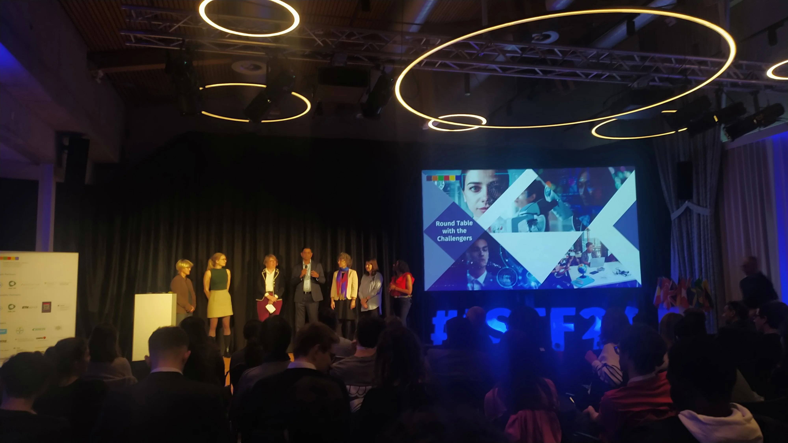
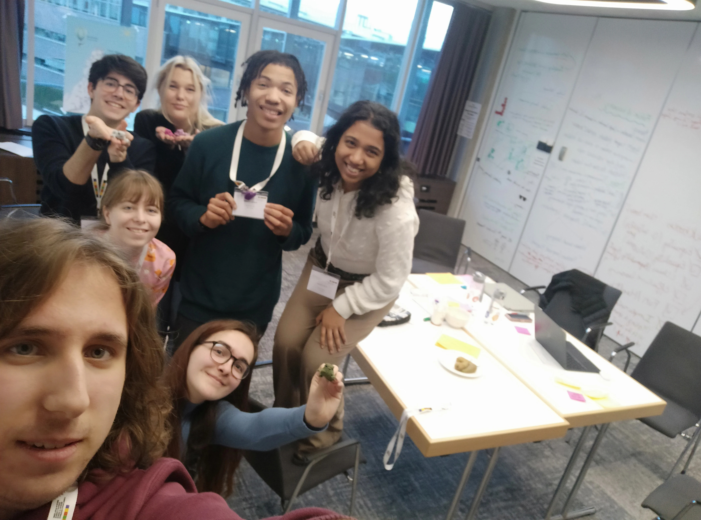

## Gün 1

Gün 0 değil çünkü varınca yarım günlük aktivite bulunuyor.

Gece 3'te kalkıp İzmir'e geldik. İzmir-SAW uçağına bindim. Bagaj vermede geçişlerde vs. herhangi bir problem yaşamadım. Alışıyorum bu işe hafiften!

SAW'a ulaştım. Biraz dolaşmanın ardından international departures'ı bulup geçitten geçtim. Tam da sırada kapım geldi, gittim onu da buldum.

Baya bi bekleyip bir şeyler yazdım telefondan, aynı zamanda müzik dinlerken. Uçağa binip yerime geçtim, 40E. En son sıra orta. Teknik olarak denk gelebilecek en kötü koltuk. Ancak arka taraf boşmuş çok, üç kişilik koltuklara birer kişi geçti. Ayaklarını rahatca uzatan tayfa. Benim elemanlar da gittiğine göre ben de o tayfadanım. Baya iyi oldu, uykum var azcık.  

Şükür bir problem olmadan indik Zürih'e. Bir saat falan uyumuşum. Biraz da yazı falan yazdım. Yalnızca ön kapıdan çıkış dediler, en arka koltuktayım. Üzücü.

Çok adrenalin dolu bi 15 dakika geçirdim. Pasaport kontrol kısmı da bagaj alımı kısmı da problemsizdi. Sonrasında tabelalardan treni buldum o da oke. Çok temiz bi sistemleri var tren bileti almada. SBB mobil uygulamasını trenin olduğu yere koymuşlar. Ben gördüm, geçtim önüme ilk çıkan az aktarmalı Notwill trenini aldım. Abi 5 dakika sonra kalkıyor ve ben daha nerde kalktığını bilmiyom. Rastgele bir yürüyen merdivene bindim aşağıya indim. Orda duran yaşlı bi çift vardı. Onlara sordum bu nereye gidiyor diye. Adam da uygulamadan baktı falan. Buna bincen önce merkeze gitcen dedi. Ordan Luzern'e ordan da Notwill'e 20 dakka. Trene bindikten sonra inerken bir daha görüştük adamla, bu sefer de vagonları gösterdi. Foto çektirtti SBB ekranı. Sonra ben de bakınca internetsiz kaydettiğim rotalara girebiliyomuşum onu fark ettim. Foto da çektim zaten. Ama efsaneydi ya. Şimdi çaktım köfteyi, genel olarak. Bakalım inşallah diğer trenlerde sorun yaşamam. Şu an son durağa kadar gitcem zaten.  

Sanırım şimdiye kadar gördüğüm en mutlu bilet kontrolcü abla geldi. Telefonla okuyo bileti, fiziksel biletlere de baya bildiğin delik açıp bi şeyler yazıyo. Çok garip.

İki tren daha binip Notwill'e vardım. Güzel yolculuklardı. Azcık yürüyüp otelin olduğu yere geldim. Check-in yapıp odaya geçtim. Oda arkadaşım dün gelmiş, babasıyla gelmiş hatta. O da vardı, tanıştık falan. Sonrasında beraber yaka kartı ve eşantiyon almaya gittik.  

Saat 15.00'de Julian Cancino, ISTF'in organizasyon lideri ile toplantı yaptık. İnsanları tanıttı genel olarak, organizasyon ekibini vs. İşleyişten bahsetti. Gün gün ne yapacağımız zaten yazılı bookletlerde. Planlı.  

Ardından her iki dakikada bir arkadaş değiştirdiğimiz bi ice breaker yaptık. Sohbet muhabbet. Farklı şekillerde bu etkinliğe gelen var. Kendi takımımdan biriyle konuştum orda. EUCYS'ten gelmeydi.

Ondan sonra kendi takım odalarımıza geçtik. Tüm takım ile orda tanıştık. Dört oyun oynadık: ilk birbirimizin yüzüne bakarak kağıtlara bakmadan yüzlerimizi çizdik ve kendimizi tanıttık. Sonra rastgele 4 kişilik takımlar halinde tek bir kağıttan ve biraz banttan köprü yaptık ama konuşmadan. Sonrasında takım A ve takım B olarak konuşmalı yarışma yaptık. Bu sefer 10 kağıtla ve daha fazla bantla. En son da main contribution, what I want from you ve my weaknesses kısımları hakkında postit çalışması yaptık.  

Oradan beraber yemeğe geçtik. Güya takımcak oturcaktık, azcık yalnız kaldım bi an masada, yan masadaydı benim takımdakiler. Ama sonra benim masaya takım 5B'den arkadaşlar geldi. Onlarla baya bi muhabbet ettik vs. Almanca konuştum, biri İsviçreliydi. Diğeri de İsveçli.

İzin isteyip odaya geçtim. Bizimkilerle konuştum. İnterneti ilk başta yapamasam da sonradan hallettik Allah'tan da problem çekmiyoruz.  

Akşam 9.30 gibi yattım.

## Gün 2

Sabah 7.10'da kalkıp (ilk 7 alarmını kapatmışım) kahvaltıya 7.30 gibi geçtim. Bodybuildercı, web app devci İsviçrelilerle kahvaltı yaptım. Kötü elemanlar değiller. Ardından odaya çekilip rapor hakkında çalışacağım bir yarım saat bir saat. Sonrasında büyük adamlar gelip açılış konuşmasını yapcaklar sanırım.

Konuşmanın başında 70 yaşında pirim konuştu head of bilmem ne. Ama kağıda falan bakmadan. Adam 70 yaşında klarnet öğrenmiş. Büyük adam.  

Sonrasında 1 saat boyunca Karen'ın biri konuştu. Abi sıkıcı ya. Intelligence'ın tanımı ve öğrenimden falan konuştu. Aslında sevdiğim konular da abi bilmiyom kötüydü ya bence. Baya sıkıldım. Kadın baya bildiğin zeki olmayan üni okumasın diyo. Zaten yapamıyolar diyo ETH'da. Zor kararlar.

Konuşmadan sonra ufak bir kahve arasının ardından Challenge 5'teki takımlar ve Challenger'ımız ile toplantı yaptık. İyi kadın. İngiltereli, kocası Danimarkalı falan. Bize daha önce attıkları sunumu sözlü bi şekilde yaptı. Tek tek tanıştık vs.

Ardından öğle yemeği. Yemekler iyi ya şükür. Bodybuilder İsviçrelilerle takıldık. Eğitim sistemi ve seçim hakkında konuştuk. Chill.

Sonrasında takım odalarına geçip muhabbete başladık. Brainstorming diye bir şey yapmamışım daha önce bence. Baya farklı baktılar takım arkadaşlarım. Güzeldi bence. AI tanımını çok iyi yapamıyorlar yine de ama olsun. Ben anlattım, araştırdılar azıcık öyle. Must read'leri okumamışlar. Ben iyi ki okumuşum ama ya iyi oldu bence.

Arada bi yürüşe çıktık, onun dışında takım odasında 3-4 saat durduk. Çok zorlu bir çalışma yapmadık ama yine de yoruldum sanırım. Güzel fikirler bulduk gibi. Bir garip yan, tüm fikirleri birleştirmeye çalışıyorlar. Spesifikleşmekte çok iyi değillerdi bence. Ama olsun ya yine de günün sonunda düz bi problem statement ama çok da kötü olmayan bir çözüm bulduk. Sanırım yarın da bu çözümü biraz daha netleştircez, belki bi UI falan bilmiyom. O yarının problemi.

Az sonra diğer grupların problem statement'ları tanıtılacakmış challenger'lar tarafından. Ardından akşam yemeği. Yemek sonrası rapor kascam muhtemelen. Bakalım bilmiyom. Yarın da bir süre boyunca bambaşka bir problem statement hakkında fikir yürütcekmişiz. Keyifli olcak gibime geliyo.

Challenger sunumlarını Karen yönetti. Garip garip şeyler sordu millete. 5 challanger da güzel bence, kötü insanlar ve araştırma konuları değil ama banko bizim kadın en iyisi ya. Çok enerjik, çok mutlu ve tam bi AI araştırma arzusu var. Sevdim baya.

Akşam yemeği güzeldi, doyurucuydu baya. Ekmek, baya kızarmış bi peynir, her zamanki salata. Çok yanlış gruba oturduk ama ya. Akşam yemeği için beklerken iki takım arkadaşımla muhabbet ettik baya. Onlarla takılması yine keyifliydi de restorana geçince başka bi takım arkadaşı ve onun arkadaşlarıyla takılalım dedik. Elemanlar kendi içlerinde iyiler güzeller de bize çok söz düşmedi, onu geçtim dümdüz boş yaptılar çok zaten, ciddi bi konu üzerine konuşulmadı vs. Ben de sallayıp bizimkilerle konuşmaya çıktım. Birkaç kişiyle mesajlaştım falan. Sonra izin istedim geldim odaya. Şimdi raporla uğraşcam. Bu hafta bitirmek istiyorum.

## Gün 3

Gece baya bi çalıştım. Çok çiçek oldu valla. Gece geç yatmama rağmen sabah uyanma vaktine yakın iki kere gözlerimi açıp saate baktım. 07.15 gibi giyindim ve poğaçalarımdan yedim baya bi. Baktım oda arkadaş kalkmıyo, onu kaldırdım. Şimdi onu bekliyom, bilmiyom elemanı kahvaltıya yetiştirebilecek miyim. Ben tokum da, kahvaltısız gitmesini istemiyom yani onun da.

Kahvaltı salonunda yalnızca meyve suyu içip Guacamalalı arkadaşla konuştum. Oda arkadaşım da geldi hatta. Son 3 dakika kala falan kahvaltı yaptı. Ardından Aula'ya geçtik, günün programını öğrendik. Dünde söylendiği gibi ilk iş olarak diğer grupların bulduğu problem cümleleri üzerinde sabahki konferansta anlatıldığı gibi storyboarding yaptık. Her konu için uygun olduğunu düşünmediğim bi muhabbet. O kalemlerle resim yapmak da kötüydü ne yalan söyleyeyim. Neyse. Sonrasında çizdiklerimizi birbirimize anlattık. Copyright muhabbetleri baya saçma zaten. Herkes aynı fikirde. İşte bi platform olsun, hükümet para versin falan filan. Boş işler. EBA yapın abi siz de. EBA cool.

Sonrasında yeniden Aula'ya dönüp karar alma mekanizmaları hakkında bi konferans dinledik. Oldukça güzeldi, keyif aldım. Ancak nedense çok uykum var, gözlerimi açık tutmada bi tık zorlanıyorum. Ama elimden geldiğince dinledim. Now-How-Wow koordinat sistemi güzel olay, slaytları ms teams'den almam lazım.

Sıkıcı bi kahve molasının ardından takım odalarına döndük. Haliyle herkes kendi storyboard'unu oluşturduğu için neler yazdıklarını incelememiz gerekiyordu. Benim önüme düşen bizim düşündüğümüz AI classmate muhabbetini yazmış zaten. Ben de bi göz gezdirdim, sonrasında da bu notları yazmaya koyuldum. Zaten hemen hemen bir fikrimiz olduğu için tüm günü nasıl geçircez bilmiyorum açıkçası ama bakalım. Akşama da Luzerne var, bilmiyorum o nasıl olcak. Yemek yemek istemiyorum açıkçası ama benim gibi düşünen yemek yemeyecek olan olacağını da sanmıyorum. Bilmiyorum belki yalnız gezerim.

Bugün akşam yemeği yok ancak Luzerne gezisi var. Akşam yemeğini orada yemek için 30 chf verdiler. Bakalım nolcak, ne yapcağımı da bilmiyom. Kime takılcağımı da. Akşam yemeği yiyip yemeyeceğimi de. Bakcaz.

Chantalle (challange 5'in challanger'ı, bizimki) ile bi tık konuşmanın ardından günü sonlandırdık. Kadın baya tatlı ama bir türlü AI bilgisini anlayamadım. Genel prensipleri hakkında mı bilgili yoksa gerçekten de image generation (en ilgili olduğu alan sanırım) hakkında ciddi bilgilere sahip mi, bilemiyorum. Biraz fazla optimistik zaten konuya. Ne yapsak beğencek. Ya ne yalan söyleyeyim bugün biraz saçmaydı, özellikle ilk bi 3 saat falan. Abi dün zaten aklımızda fikir vardı. Yalnızca birkaç detayı netleştirip tüm günü bitircektik. Sanki çok ciddi bi problem varmış gibi oturup düşündük tartıştık falan. Allah'tan nasıl başladıysak bi şekilde birbirimize sorular sormaya başladık konu hakkında da o şekilde netleşti işler. Bilmiyorum ama ben pek de memnun değilim günden. Akşam çok güzeldi ama.

Gün sonunda bahsettiğim gibi yemek ve gezmek için Luzerne'e gittik. Önce otobüste takımı kaptanı (diktatör diyoruz daha çok) ile oturdum. Oldukça tatlı bi insan. Kendini zorlamayı seven bi tarzı var ki çok saygı duydum. Otobüsten inince takımdaki diğer İsviçreli (Çifte vatandaş hatta 3.yü almaya çalışıyo) arkadaşla takıldık. O, ben, Danimarkalı ve İsveçli. Hemen hemen tüm akşam zekice davranıp safe oynadım kartlarımı, pizzacıya götürdüm bizi. Margarita yedim, güzeldi. Yemek gelmeden önce bi kart falan oynadık o garipti. Bi ara politika döndü. Falan filan çok da önemli değil. Yemek sonrasında etrafı gezdik, foto çektik vs. Oldukça yağmurluydu gerçi ama yine de keyifli bi geziydi. Dönerken de Danimarkalı ile oturdum.

## Gün 4

Sabah duş aldım bi. Sonrasında kahvaltı. Daha önce oturduğum bodybulider'cı adamlar dışında birisi yoktu boşta. Çok da vakit yoktu zaten. Yedim, Aula'ya geçtim.

Günün tanıtımının sonrasında masterclass'lara geçtik. Hata ettim. Kesinlikle story buidling'i almam lazımdı ama gittim presentation creation'ı aldım. Çok fazla bi şey öğrenmedim açıkçası ne yalan söyleyeyim. Kötü değildi ama o kadar da dolu değildi. Elemandan biraz daha fazla gerçek örnek vermesini isterdim.  

Ardından çalışma saatleri geldi. *Core message*'ımızı vermemiz gerekiyomuş story builder elemanlara. Tam olarak nedeninin bilmiyorum. Şu anda güzel bir cümle kurmaya çalışıyoz. Sunumu ben hazırlıcam ama iki kişi yapcak sunumu takımdan. Allah'tan sunum çalışmıcam. Gerçi herkese beğendirme var da. Bakalım.

Masterclass'lardan sonra sunum hazırlamaya geçtim. Tüm gün de sunum hazırladım. Diktatörüm stili beğenmedi ama. Renk paletini bulmuş oldum Allah'tan en azından. Akşam yemek yiyesim gelmedi. İstediklerimi çok yapamadım. Düşünce sistemimiz çok farklıydı ya takım kaptanıyla. Onun dediğini yapmam daha doğru diye düşündüm dolayısıyla fikirlerimde diretmedim. Bence doğru olanı da yaptım, zaten sunumu yapcak olanlar onlar. Yorucu bi gündü evet ama daha çok yorulduğum günler biliyorum o yüzden npcannes.

Şimdi de göle gidiyoruz. Baya baya mantıksız hamle benim için. Haftanın en büyük hatasını yapıyorum gibime geliyor ama bakalım. Çok geç dönmesek bari.

Göl güzeldi baya, kesinlikle bi hata değil güzel bi deneyimdi. Biraz arkadan geliyoduk Mathys'le, geldiğimizde bi baktık millet girmiş göle o soğukta. Ben montla rahattım da yani montu çıkarsam eminim biterdim yani. He bi de baya bildiğin hazırlıklı gelmişler girmek için yani ani bi çılgınlık falan da değil. Çok garip. Dönüş yolunda da her gördüğümde farklı dili konuşan arkadaşla konuştum. Harbiden çok garip insanlar var dünyada. Fransızca, Almanca, İsviçre Almancası (Swiss-German diyolar), İspanyolca ve Japonca (çok değilmiş gerçi de) biliyomuş. Bir takım arkadaşım, ben, o; diller hakkında konuşa konuşa geldik.

## Gün 5

Sabah kalktım, baktım oda arkadaşı yok. Eleman hiç gelmedi sanırım, sormadım da gerçi de. Tam çıkıyodum, geldi tam o anda. Dedi işim var sen geç, ben burdayım. Dedim ok.  
  
Kahvaltı yaptım bizim ekiple. Sonrasında takım odalarına geçtik. Bi döküman vardı, AI prompt'larını girmemiz gereken ve birkaç bilgi istedikleri. Daha önce dediydim de çok da önemli olmadığı için acele etmediydik, iyi de etmişiz çünkü vakit verdiler doldurmak için. Ardından haftayı nasıl geçirdiğimizin *grafiğini* çizdik ve kazandığımız en önemli özelliği (takeaway) anlattık. Şimdiyse green room dedikleri şeyi yapıyoz.
  
Green room için otelin etrafında tur attık. Soğuk vurunca güzel oldu. Bakalım şimdiden de sunumlar olcak. Heyecanlı anlar. Bizimki en sonda ama foto çekmek istediğim projeler ve insanlar var.

Green room sonunda salona geçtik. Bizimki haliyle programda en sonda. O zamana kadar başkalarını dinleme zamanı. Sonrasında bizimkiler sunum yapcaklar, biz sahneye çıkcaz, iki üç soru ve bitiş. Nedense kendim için hemen hemen hiç heyecan duymuyorum ama sunum yapacaklar için duyuyorum. İnşallah güzel geçer sunumları.

Allah'ım dehşet sunumlar dinledik. Abi yok böyle bi şey, hele bi tanesi vardı unutamıyorum ya. Takım arkadaşlarım yanımda yanımda, birbirimize bakıp "Sunum yapan kız ne diyosan haklısın, ne istiyosan vereyim, istersen ruhumu al" esprisi yaptık. Harbicili o kadar güçlü sunum yapan birini daha önce görmedim ben hayatımda.

Kahve molasında yurttan Ozgurkaraca ve Leylek'le konuştum. Chill.

Bizim sıramız gelince sunumu yaptı bizim arkadaşlar. İnsanlar sunumu baya beğendi çünkü güzel bitirdik, "equity"'yi anlatmak için kısa boylu olan basamağın üzerinde çıktı ve uzun boylu olanla aynı hizaya geldi falan. Güzel fikir. Sonra biz de geçtik sahneye. Takımcak çıktığımızdan gram heyecan duymadım. Chantelle (bizim challenger) geri bildirim verdi. Kadın zaten hemen her zaman çok mutlu abi, kötü bi şey söyleyemiyo gibime geliyo. Ondan sonra diğer sunumlarda da garip garip konuşan topic leader geldi, dedi işte "bilimsel olarak öğrenme stilleri ile öğrenmenin bi alakası yok" falan. Bizim proje de biraz onun üzerine kurulu. Sonra pirim Danimarkalı arkadaş mikrofonu aldı, dedi ki katılmıyorum size. Salon alkışlaması falan. Herkes kadına kızgın.

Biz sondan bi öncekiydik. Sonrasında challenger'lar ve topic leader azcık konuştu. Orda da bizim challenger çıkıp ben de topic leader'a katılmıyorum demesin mi abi şlfkgdşlfkgdfg. Salon Chantelle'i tutuyo deli gibi alkışlıyo. Laflar geliyo gidiyo falan. Çılgındı. Sonra pirim Julian geldi dedi chill, gidin yemek yiyin. Biz de öyle yaptık.

Yemeği ayakta Foyer'de yedik zaten. Başka misafirler de vardı çünkü. Çok değil 30 kişi falan. Herkes dahil toplamda 130 kişi falandır. Chantelle'e bi teşekkür ettik yanımızda durduğu için.

Ardından trene bincek insanlarla beraber göle gittik bir kere daha. Gündüz görmek güzeldi. Ama hava baya kapalı o yüzden çok da gündüz değildi. Trenler giden arkadaşları uğurladık, azcık takıldık orda falan sonra döndük otele. Soğuk zaten, raporla uğraşmak dışında çok bi şey yapcağımı düşünmüyorum. Tren saatleri falan bakmam lazım yarına. Zürich'te ne kadar dolaşcağımı da bilsem güzel olabilir. Ayarlıcam akşam.

## Son Değerlendirme

Etkinlik dediğin böyle yapılır abi. Her şey max-min 3 dakika gecikmeyle. Zamanlama muhabbetini geçtim; etkinliğin gerçekten çok çok dolu olması (yaptığımız onca değişik aktivite vs.), 80 kişiyle çok rahat başa çıkabiliyor olmaları ve aynı zamanda bizim için belki önemsiz gözükebilecek bir sürü şeyin olması (mesela visulazation şeysi: her takım problemin ve çözümün ana fikrini bi ressama anlattı, sonra eleman çizdi, sonra sunumda kullandık.).

Yorucu zamanlar yaşadık, oldukça sıkıcı zamanlar yaşadık takımcak. Kimi zaman modumuz çok düştü yorgunluktan ve/veya sıkkınlıktan. Kimi zamansa kahkaha ata ata bi hal olduk. Özellikle 4. gün, cuma günü onca işin arasında kafalar allak bullakken baya bi dalga geçtik İngiliz aksağanıyla falan. Keyifli zamanlar.

Etkinliğin başında da insanlara dedim, benim öyle çok ciddi bi şekilde başka insanlarla çalışma tecrübem yok. (GYEC yaptık iki kere de, tüm gün ve tanıdığım insanlar olduğu için hep tam olarak buradaki gibi değil olay.) Gerçekten bu konuda güzel bir tecrübe edindim gibime geliyor. Hiç tanımadığın insanlarla 3-4 gün boyunca tüm gün bir şeyler üzerine kafa yormak, onları dinlemek, anlamak, laf anlatmak. Baya bi iş. Ama gerçekten çok keyifli geçti. Köprü yapmaktan tut, haftanın nasıl geçtiğine dair yaptığımız grafik çizimine kadar, toplu yaptığımız her etkinlikten keyif aldım gerçekten de. Güzel bir sinerji yakaladık.

Dil. Takımda İngilizcede bi tık problem çeken bi Portekizli arkadaş vardı. Dediklerini anlıyorduk ama çılgın kelimeler kullanmıyodu, aksağan da düz. Özgüveni düşüktü önce ama sonradan baya bi açıldı. İyi çocuk. Ben ne yalan söyleyeyim bazı yerlerde sıkıntı çektim dil ile. Temel şeylerde hemen hemen hiçbir problem yok, ancak ne zaman belirli bir alana bağlancaz, eğer kendi alanım değilse tıkanıyorum. Vocab çalışmam lazım gerçekten de. Burda yeni kelimeler öğrendim ama anlamını bilmediğim kritik kelimeler de var hala. Bilmiyom belki bi ara oturup ciddili bakarım.

Avrupa, garip. Birçok farklı milletten arkadaşla, birçok farklı konuda muhabbet ettik. Yalan yok hepsini hatırlamıyorum, yazma gereği de duymadım. Ama şunu diyebilirim ki bizim sahip olduğumuz sistemlerden çok farklı. Eğitim sistemlerinde mesela, gerçekten de öğrenciyi menzile alarak, farklılıkları önemseyerek hareket ediyolar. Acayip şeyler duydum ve ne yalan söyleyeyim çok üzüldüm bizim çocuk ve gençlerimize. Gerçekten zor bi hayat yaşıyoruz ben sana söyleyeyim.

Genel düşünceler vs. bittiğine göre, son cümlelerimi otel odasında, solumda oda arkadaşım (ve babası) takılıyolarken iken yazıyorum. Gerçekten çok güzel bir hafta geçirdim; gördüğüm yerler, tanıdığım insanlar, yaptığım irili ufaklı aktiviteler, dinlediğim bir sürü sunum... Raporda da yazdığım gibi,

> Bana ülkemi temsil etme fırsatı verdiği için TÜBİTAK'a sonsuz şükranlarımı sunarım.
